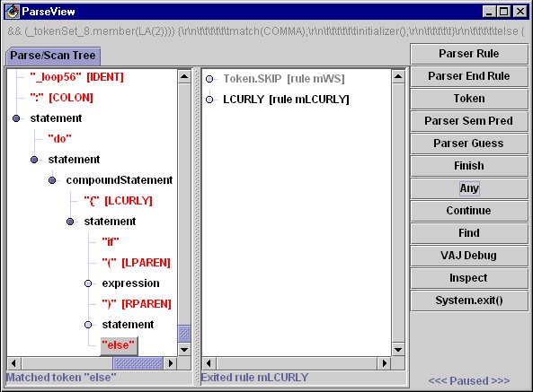
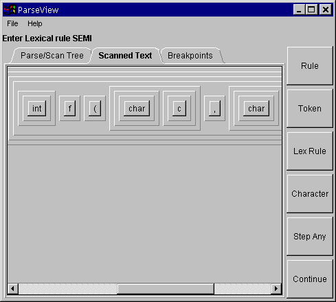
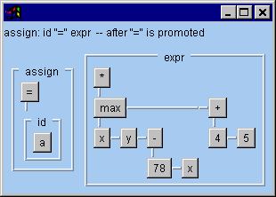
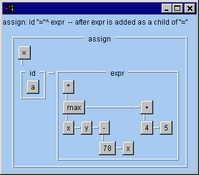

Visual Debugging for ANTLR 2.x

<!--more-->

# Status

*   10/17/2018
    *   Cleaning up my website. This tool is obsolete; it was a debugger for ANTLR 2.x. I'm keeping it here for historical purposes. (Wow... It's over 20 years old!)

*   6/17/1999

    *   [ParseView 1.2](parseview1.2.zip)** released! This source-only release will _only_ work with
    *   ANTLR 2.6.0 and later
    *   JDK 1.1.x _or_ Java 2
    *   Swing with package names starting with `javax.swing`
        *   Included in Java2, or
        *   Swing 1.1 or later

    *   You need to compile the distributed files in [parseview1.2.zip](parseview1.2.zip) and place them in your CLASSPATH. Then follow the operating instructions at the end of this page.

*   1/22/1999

    *   *You can now download ParseView from this link: [ParseView.zip](ParseView.zip).* (People had trouble finding it at [http://www.antlr.org](http://www.antlr.org).)
    *   ParseView will be distributed as an add-on feature.  Terence and I decided it would be easier for me to provide updates if I controlled it.
    *   This version of ParseView _only_ works with ANTLR 2.5.x and _earlier_

*   7/17/1998

    *   I've given a first pass of the tool to Terence.  He's checking things out and making sure I didn't break ANTLR.
    *   Developed a good debugging model for ANTLR that will make it easy to add any sort of debugger you want (especially ParseView).  The API for this will eventually be documented so people can add their own debuggers, simple (like just "println"s) or complex, like ParseView.
    *   ParseView will be a _free_ part of the real ANTLR distribution.  Terence and I realized it would just be too much work to try to really have this be supported the way a "pay" tool should be.  We just don't have that much time.  Instead, we're releasing it _with source_ so others can add to it.
    *   The source will be included with the distribution.  Please _**refrain**_ from making changes just yet -- I'd like to add a few more things, like breakpoints and some AST stuff before people start sending in changes to integrate.

Send mail to [Scott Stanchfield](mailto:scott@javadude.com) with any comments, suggestions, ideas or recipes!

* * *

# Current State of the Tool

The tool currently supports the following features.

*   Parse Tree and Scan Tree
    *   Rules entered
    *   Tokens matched
    *   Semantic Predicates
        *   result of the predicate evaluation
        *   predicting or validating
    *   Syntactic Predicates
        *   when they are started
        *   when they finish
        *   if they failed or succeeded (color coded red or green)
        *   Rules and tokens inside a guess are displayed with a yellow background
    *   Status of parse (what was matched when parser paused, line numbers while parse is running)

*   Controller
    *   **Note:** The controller currently _only_ controls the Parse Tree -- you cannot step using through the scan tree yet.  Sorry -- I just ran out of time...
    *   Step to next rule entry
    *   Step to exit of current rule
    *   Step to next matched token
    *   Step to next semantic predicate evaluation
    *   Step to start/end of next syntactic predicate
    *   Step to any of the above
    *   Continue parse until any of the buttons are pressed
    *   Stop the program (System.exit(0) called)
    *   Find text in the Parse Tree (again -- not implemented for Scan Tree yet)

*   Character "ticker"
    *   Shows consumed characters during scan at top of screen.

*   VisualAge for Java Debugging Hooks
    *   Start VisualAge for Java debugger at current position
    *   Inspect current parser instance

* * *

# Known Problems

*   Swing JTree
    *   Apparently has a limit on how many rows it will display
        *   I'm hoping this is a bug that Sun will fix, otherwise I'll need to go back to my own treeview again
    *   Sometimes doesn't properly scrollPathToVisible() -- when you pause the parse you may need to adjust the scrollbars to see the newest edition to the Parse or Scan trees
*   "Finish" and "Continue" do pretty much the same thing - I'll probably remove the "Finish" button

* * *

# Planned Features

*   Socket-proxy for debugging interface
    *   Provide a proxy listener that can gather parser events and send them across a socket
    *   Provide a debugger "server" that listens to a socket, creates the new debugging events and sends them to real listeners (like ParseView.)
    *   This will allow
        *   Remote debugging
        *   Debugging from non-Java parsers (ie C++) w/o JNI (they can access ParseView)
*   Token ticker
    *   Like the character ticker, but with tokens
*   Breakpoints
    *   Rule, token match, syntax error
    *   In context -- for example, "break in expression in ifStatement"
    *   Source line number
    *   Source text
    *   Before/After manipulating an AST
    *   On a failed/succeeded predicate

*   Scanned-text view
*   Documentation on ANTLR 2.0 debugging API
*   Add a Swing toolbar for the controller buttons

*   Filter tree contents
    *   "show only x, y and z" -- everything else is grouped into larger "ignore" boxes in the tree that can be expanded if needed.
*   Scanned-text "relief-map" view
    *   Really cool way to see how the source text is recognized by the parser/scanner
    *   Each rule entered adds a tier to the current "hill"; rule exit closes current tier
    *   Source file will be laid out as closely as possible to original input as read
    *   Shows all text that has been scanned to current breakpoint
    *   Each top-level box represents a terminal in the grammar -- the text is the text read from the source file
        *   white space is skipped in the view -- might add an option to display it
    *   ToolTips or some other mechanism will display the parse rule relating to a box at any given level
    *   Interaction between parse tree and scanned text view
        *   clicking on a box in the scanned text view will select the corresponding node in the parse tree
        *   vice-versa ('cause I'm too lazy to type the rest)
    *   Initial mock up -- I'll do a better mock up another time...
        
        
        

*   AST Support
    *   In standard tree view and graphical depiction(s)
    *   Save current tree in a serialized form
    *   Comparison against a serialized tree
    *   Track accidentally lost subtrees where possible
    *   Display ASTs before and after modification
    *   Breakpoint settings will be added to help step through AST construction
    *   All built-in AST manipulations are tracked and reported
        *   Current AST states shown at all breakpoints for all ASTs available in rule
        *   AST manipulations in action code -- investigating ways of tracking these with minimal impact
    *   May add a thumbnail view with fisheye lens -- depends how daring I feel the night I code it
    *   Note: These pictures are just rough mockups to give you an idea of what I'm thinking of...   
*   Static Grammar Analysis
    *   first & follow sets
    *   conflict displays
    *   derivation trees
    *   prediction expressions
    *   syntax ("railroad") diagrams for grammar (if I feel like it ;)
    *   Available as an ANTLR option, run immediately after ANTLR parsing completes
    *   Will assist conflict resolution
        *   provide examples of conflicts using grammar vocabulary
        *   show trees with conflicts
*   Grammar Coverage Analysis
    *   Display which rules were used during the parse
    *   Keep track of cumulative usage across runs in an external file
    *   Keep track of predicate usage to help balance cost of predicates
    *   Keep track of grammar exception usage
    *   Read Java profiling report and show overall usage information
        *   Grammar method usage
        *   Non-Grammar method usage
        *   Debugging methods filtered

* * *

# Operating Instructions

These are brief for now; I'll add more later

## Building a Parser for Debugging

Run ANTLR as you normally would, but add "-debug" to your command line.   For example:

java antlr.Tool -debug java.g

## What you'll need to run ParseView

*   You need the ANTLR distribution that contains ParseView
*   You need Swing 1.0.2
*   Your code needs to have a System.exit(0) call at its end.  Simply returning from main will not stop the program,  as ParseView starts an AWT thread which must be killed...
*   ParseView only works with programs that use **_both_** ANTLR-generated scanners _and_ parsers.  If you use a custom parser or scanner, ParseView probably won't work.  I'll be writing some adapters to make this easy to do, using the debugger interface.

Other than that, run your parser normally.  A ParseView window will appear.

## The ParseView Window

The ParseView window contains the following:

*   At the top, a line containing the consumed characters.  This will eventually also tell you lookahead characters hile moving through the scan tree
*   The main part of the display is the Parse and Scan tree area.  (This is in a JTabbedPane because there will be a breakpoint, scanned text,  and AST view pane later)
    *   The Parse and Scan tree views show the entered rules and all tokens/characters matched in those rules
    *   Any rules entered while in "guess mode" via a syntactic predicate will have a yellow background
    *   Characters that are skipped in the scan are colored gray
    *   At each stop point, the status line will say which event has happened (like a token being matched or a rule being entered or exited.)
    *   While the parse is running, the status line under the scan tree will display the current line number in the source file.  **Note:** This will only work properly if your scanner calls newline() anytime a newline sequence is detected.  Newline sequences should be "\\n", "\\r" or "\\r\\n"
*   The column of buttons (which will eventually be a toolbar) is the controller.  The buttons do the following:
    *   Parser Rule - continue parse until the next time a parser rule method has been entered
    *   Parser End Rule - continue parser until the _current rule_ has been ended
    *   Token - continue parse until a token has been matched
    *   Parser Sem Pred - continue parse until a semantic predicate is evaluated
    *   Parser Guess - continue parse unti a syntactic predicate starts or finishes
    *   Finish - continue parse _without watching for breakpoints_.  Currently, this does the same as the "Continue" button.
    *   Any - continue parse until any of the above things are matched
    *   Continue - continue parse until the next breakpoint or step button event occurs button
    *   Find - locate text in the parse tree -- this will pop up a dialog asking for text and whether you want to start at the top or find the next occurrence
    *   VAJ Debug - halt the parser and enter the VisualAge for Java debugger.  This will only appear if you are running in VisualAge for Java.
    *   Inspect - bring up the VisualAge for Java variable inspector for the Parser.  This will only appear if you are running in VisualAge for Java
    *   System.exit() -- calls System.exit(0) to stop the parser
