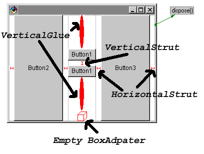

JavaBeans for BoxLayout Visualization

<!--more-->

# News

*	10/17/2018
	*	Updating this website. The VisualAge for Java version of these beans are obsolete, and I'm just keeping this around for historical purposes. The beans themselves _might_ still work in GUI builders, but I haven't tested them in years, and the source is in a VisualAge repository so I can't get to it...

*   11/26/1998
    *   With the current VisualAge fixpacks you no longer need the extra swing package.   I've removed them from the VAJ distribution
    *   I've added a JAR file distribution and tested it with JBuilder -- it seems to work just fine!

  
# Introduction

Swing's BoxLayout is a fairly useful layout manager, but using it in a visual environment such as VisualAge for Java's Visual Composition Editor isn't easy.

There are several problems to face:

*   The Box class isn't a bean
*   Support for "struts" and "glue" is only provided programmatically
*   BoxLayout uses getPreferredSize(), getMaximumSize() and getMinimumSize() to perform its calculations.  These sizes are settable for Swing components, but for non-swing components you must subclass components to change them.

This became frustrating while teaching, so I developed the **Box Beans**.   The box beans provide visual support for easy use of BoxLayout.

The following beans are provided:

*   BoxAdapter \- a simple container that can be used to change the resize behavior of any component in a BoxLayout.  It has four boolean properties:
    
    *   shrinkHorizontal - controls the "width" when asked for getMinimumSize().
    *   shrinkVertical - controls the "height" when asked for getMinimumSize().
    *   stretchHorizontal - controls the "width" when asked for getMaximumSize().
    *   stretchVertical - controls the "height" when asked for getMaximumSize().
    
    When any of these properties is false, the appropriate value from getPreferredSize() is returned.  For example, if _all_ of these properties are false, the component will _always_ be displayed at its preferred size.  If all are true, the component will stretch and shrink as needed.
    
    By placing a BoxAdapter in a BoxLayout\-controlled Container, you can have it control the resize behavior of its contained Component(s).
    
    By default, BoxAdapter uses GridLayout(1,0) as its layout manager.   It is really intended to hold a single component, though it could be used anywhere a Container is needed.
    
*   VerticalStrut - Represents a fixed-size vertical component, used for fixed spacing in a y-axis-oriented BoxLayout.
*   HorizontalStrut - Represents a fixed-size horizontal component, used for fixed spacing in a x-axis-oriented BoxLayout.
*   VerticalGlue - Represents a varying size vertical component, used to force space between other components in a y-axis-oriented BoxLayout.
*   HorizontalGlue - Represents a varying size horizontal component, used to force space between other components in a x-axis-oriented BoxLayout.

The struts have a "pixels" property that controls how much space they take up.  Glue doesn't need it, as it expands and collapses as needed.

All of the above beans have a _design representation_.  That is, when used in a bean builder, they will paint an image to easily identify themselves.  When used at runtime, no image will be painted.  For example:

Note that the struts and Glue have _minimum_ sizes that are > 0 when designing with them.  This ensures that they are visible at design time, and may cause the layout to look slightly different when the bean is actually run.

BoxAdapter in particular would normally be (0,0) when empty.   However, to help visual design I set it up to (20,20) when empty at design time.   That way you can just drop another bean right on top of it without using the Beans List.

# Distribution

I have just packaged these as a "feature" for VisualAge for Java 2.0.  I will set up a standard jar file later for use in other (inferior ;) ) environments.

## Installation for VisualAge for Java - Feature Packaging

To use the Box Beans in VisualAge for Java:

1.  Download [box-vaj.zip](box-vaj.zip) from this site.
2.  Unzip box.zip to the directory where VisualAge for Java is installed.  For example, C:\\IBMVJava.
3.  Start VisualAge for Java.
4.  Select "Quick Start" from the "File" menu.
5.  Select "Add feature" from the "Features" category.
6.  Select "Javadude Box Beans" to install the box beans.

This will add the box beans to _both_ the AWT and Swing palettes, with the following icons:

*   BoxAdapter
*   VerticalStrut
*   HorizontalStrut
*   VerticalGlue
*   HorizontalGlue

If anyone has some better icon images, please let me know and I'll include them!

## Installation for Other IDES - Standard JAR File

A standard JavaBean JAR file exists at [boxbeans.jar](boxbeans.jar).   I've tested this under JBuilder and it seems to work ok.

# Use

## VisualAge for Java

To use the Box Beans (once they are installed)

*   Open a class to the VCE
*   Add a Container (Panel, JPanel, whatever) to your composition
*   Set that Container's layout to BoxLayout
*   Drop combinations of of the beans in the BoxLayout\-controlled Container.
*   If you want to add other beans (like a java.awt.Button), drop a BoxAdapter in the BoxLayout first, then drop the other bean inside it.  Adjust the properties of the BoxAdapter to get the resize behavior you want.
*   Adjust the "pixels" property of the struts to control how much space they reserve.

## Other IDEs or BeanBox

Setup and use depends on the IDE in question.  As I test against other IDEs I will post usage instructions.

In JBuilder, you can add the jar file to the palette and use it the same way as in VisualAge for Java.

# License

Box Beans are free for _any_ use _other_ than selling them as a stand-alone product.

Note that these beans are provided "as-is" without any warrantee or guarantee of suitability for any purpose. Scott Stanchfield cannot be held responsible for any damage caused by use of these beans.

(In other words, use 'em for free at your own risk.)
