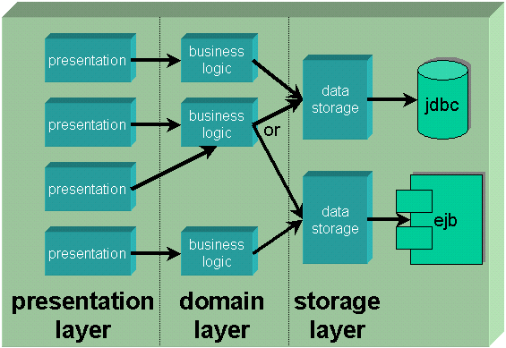

Maintainable applications can be quite tricky to develop. One of the keys to creating such a beast, is to properly layer your application.

<!--more-->

Separation is the key to maintainability. The more separate the parts of your application are, the lower the coupling between them, and changes to the guts of one part have less (or optimally no) effect on the rest of the application.

Your biggest enemy in the quest for a maintainable application is direct communication.

Let's get one thing out of the way right up front. **_Never_** talk directly to an EJB. I don't care what Sun or IBM says.

Reason? Simple. EJB is a _technology_, not a component in your application.

## What are application components?

Think of your application as having components, similar to a stereo. We're not talking GUI Widgets here (AWT Components), we're talking about sizeable chunks of your application.

There are several benefits to a component stereo system:

*   You can build it up starting with a few pieces and add more pieces over time.
*   If a piece breaks, you can replace it or repair it without affecting the rest of the system.
*   You can choose _any_ receiver, _any_ CD player, _any_ equalizer, or even _any_ record player, mixing and matching to create _your_ system.
*   If a better component comes along, you can replace _just that component_ without affecting the rest of the system.

Brilliant idea, eh?

We can apply this concept to software with some amazing results:

*   _You can build it up starting with a few pieces and add more pieces over time._  
    Can you say "lower startup cost, faster time to delivery?" If you only need part of the application, you can just concentrate on that part if you think in terms of components.

*   _If a piece breaks, you can replace it or repair it without affecting the rest of the system._  
    Face it, when you fix a bug, there's a good chance that you'll break something else. The more isolated/standalong your components are, the better chance that impacts remain local to the place you changed, making them easier to notice beforehand and fix if found later.  

*   _You can choose any receiver, any CD player, any equalizer, or even any record player, mixing and matching to create your system._  
    Think "technologies" here. We can use _any_ presentation technology, like an AWT GUI or a JavaServer Page (JSP). We can use _any_ data management technology (EJB Entity beans, direct database access with JDBC.)  

*   _If a better component comes along, you can replace just that component without affecting the rest of the system._  
    Suppose tomorrow "Schmoo" becomes available. "Schmoo" is the newest, bestest, fastest, coolest, data management technology ever. (Kinda like folks are pushing EJB right now.) Wouldn't it be great to just replace the data management component with one that uses Schmoo instead of EJB?

The key here is isolation. The more isolated your components, the more real the benefits become.

And what makes this possible?

## Interfaces are the key

Think about what makes a component stereo work so well, or how we can use the same spark plugs in a Pacer (forgot about that, eh?) and a Rolls Royce.

The _interface_ between the components is what makes it possible!

Components in a stereo use a common interface: RCA jacks and obfuscated setup manuals. Cars use common interfaces for their components as well, such as the threading and contacts for a spark plug.

In the same manner, interfaces are the key to separation in your application. If you have two components that need to talk with one another, define one or more interfaces to lock down that communication. Once you have the interfaces in place, _it doesn't matter **what** the components actually **are** or **do**, as long as they respect that communication!_

Think about this for a moment. Suppose we define:

```java
public interface Customer {
    public String getName();
    public void setName(String name);
    ...
}

public interface CustomerManager {
    public Customer   load(int id);
    public Customer   store(Customer customer);
    public Customer[] findByName(String namePattern);
    public Customer   createCustomer(String name, float creditLimit);
    public void       deleteCustomer(Customer customer);
}
```

Notice how this _does not_ say anything about _how_ or _where_ the customer is stored. All we're doing here is specifying the basic CRUD (Create, Read, Update, Delete) operations that you need for a piece of data.

## Wow, I can reuse things!

Sorry, bud, you missed the point...

I've often heard phrases like "software is like cars; you can reuse spark plugs, pistons, even the whole engine."

Can you say "apples and oranges"?

Sure, if all I wrote were personal information manager applications, I could reuse the notepad, address book and email components constantly. _But do I really write the same type of application more than once???_ Of course not!

(Note: Reusing things like MS Excel inside Word isn't a new type of app... they are both "office apps")

### So why are components good, if not for reuse?

Think about stereos, refrigerators, and cars.

If you examine them at a microscopic level, they all reuse molecules. Go up a bit farther, and they all share transistors, but as your components grow bigger, they become _more domain specific_. Domain-specific components can really only be used in one type of application. You can't take your car's engine and use it to build a fridge.

Small enough components, like GUI Widgets, and data structures like Java's Vector and Hashtable, are incredibly reusable. But that's really low level.

Thinking of _application_ components, the real benefit is in the upgrade and repair department, _not_ the cross-application reuse department.

If you had separated your application into components, and one of those components is a CustomerManager (defined as the interface above), you're in great shape. Suppose your initial CustomerManager implementation uses JDBC calls to store and retrieve data. If you want to upgrade to EJB, all you'd need to do is change the implementation of the CustomerManager. (There's a few gotchas we'll hit later, such as generic exception handling, though. The simple definition of CustomerManager above isn't quite enough, but it's presented here to get the basic idea across.)

## Application layering

Components fall into _layers_ in your application. Each layer has a specific set of responsibilities, and defined communication with other layers.



The current ideal way to design your application is to provide nice, clean interfaces between layers:

*   **Presentation Layer** (aka User Interface Layer)  
    Displays data to user and accepts i/p -- no business logic at all!  
     
*   **Domain Layer** (aka Business Logic Layer)  
    The "smarts" of your application  
     
*   **Storage Layer** (aka Data Management Layer)  
    The code that fetches and saves data for you

Note that I said "current ideal". Architecture evolves over time, and this is a _current_ best practice. Newer and better techniques will come along, but they should grow from this approach.

Each of the three layers has specific responsibilities, and can be composed of one or more components in your application. The dotted lines between the layers in Figure 1 represent the separation between the layers, and are written using one or more interfaces.

Any number of presentation components (GUIs, JSPs, Servlets, Consoles) can present data to the user and accept user input. They communicate with the business logic of the application to request data to display and ask for modifications to the data. The business logic asks the data managers for data, and may modify that data before returning it to the presentations.

## Skipping layers is a no-no

_Communication should **never** skip layers!_ This is _incredibly_ important, though it may not seem obvious at first.

One of the key sins committed by application developers is having their user interface talk directly to the data managers. _The business logic is there for a reason, folks!_ If you skip past the business logic, the "smarts" of the application doesn't have the _opportunity_ to do anything with the request. At first, you may not see a need for passing through, but you _should_.

For example, suppose you're implementing a simple online store application. You may at first think it's ok for the presentation to directly ask the data managers for the list of items to display. Hey, it's just a list, after all...

But what happens when you want to put those items on sale? Ok, so you go and modify the presentations to list a 20% off price. But there could be a bazillion pages that display the item, and all it takes is _one_ missed page to give an inconsistent presentation to the user.

So, you _could_ change the data manager. But now _all_ business logic sees the change.

If you had the presentation call the business logic, instead of directly calling the data managers, all you would need to do is change the business logic and all pages that use the business logic see the change! You could even implement filters that decorate the business logic (see _Design Patterns_, by Gamma et al) to transform the data.


## Generic exception handling

The hardest part of making your application nice and generic is dealing with exceptions.

Let's just think about our CustomerManager:

```java
public interface CustomerManager {
    public Customer   load(int id);
    public Customer   store(Customer customer);
    public Customer[] findByName(String namePattern);
    public Customer   createCustomer(String name, float creditLimit);
    public void       deleteCustomer(Customer customer);
}
```

This definition has some serious problems. If anything goes wrong, the caller needs to know about it. So we'll need to declare some thrown exceptions for error cases.

_But what exceptions should we throw?_

Let's start by thinking about and implementation using JDBC. JDBC throws SQLExceptions (btw: SQL is properly pronounced "squeal", no Ned Beatty references, please.)

So we could write a class that looks like:

```java
public class CustomerManagerUsingJDBC implements CustomerManager {
    public Customer   load(int id) throws SQLException {
        ...
    }

    public Customer   store(Customer customer) throws SQLException {
        ...
    }
    ...
}
```

and then modify the interface to also throw those exceptions. Ok so far, and we set up the business logic to catch SQLExceptions as necessary.

### Uhhhh, but what about EJB?

But things get nasty if we try to change the implementation to use Enterprise JavaBeans:

```java
public class CustomerManagerUsingEJB implements CustomerManager {

    public Customer load(int id) throws EJBException, RemoteException {
        ...
    }

    public Customer store(Customer customer) throws EJBException, RemoteException {
        ...
    }
    ...
}
```

Accessing EJBs could throw EJBException or RemoteException. Ok, so we'll modify the interface to use EJB, then change the code in the business logic.

**Wrongo!!!**

_The whole point of this article is easier maintenance._ Easier maintenance relies on one commandment: thou shalt not change thy interface!

Think about what this does. Anytime you change the data manager, you'd need to change the business logic to "match" its exceptions.

### So, uhhhh, how do we deal with exceptions?

Ever hear of application-defined exceptions?

What is the actual problem _from the point of view of the business logic_?

*   "Can't get the data"
*   "Can't store the data"
*   "Data not found"

Those are a few simple cases. Ok, let's define custom exceptions to deal with this.

```java
public class MyApplicationException extends Exception {
    private Throwable nestedException;
    public MyApplicationException (String message, Throwable nestedException) {
        super(message);
        this.nestedException = nestedException;
    }
    public Throwable getNestedException() {
        return nestedException;
    }
}

public class CustomerException extends MyApplicationException {
    public CustomerException(String message, Throwable nestedException) {
        super(message, nestedException);
    }
}

public class NotFoundException extends MyApplicationException {
    public NotFoundException(String message, Throwable nestedException) {
        super(message, nestedException);
    }
}
```

Now we define the interface as follows. Note that this is how we _should_ have defined it in the first place, so it won't require changes.

```java
public interface CustomerManager {
    public Customer load(int id) throws CustomerException, NotFoundException {
        ...
    }

    public Customer store(Customer customer) throws CustomerException {
        ...
    }
    ...
}
```

Now the interface is _totally generic_, with respect to how we store the data! A sample JDBC implementation might look like:

```java
public class CustomerManagerUsingJDBC implements CustomerManager {
    public Customer load(int id) throws CustomerException, NotFoundException {
        try {
            // JDBC to try to fetch data
            if (resultSetIsEmpty)
                throw new NotFoundException("Customer " + id + " not found", null);
            
        } catch(NotFoundException e) {
            throw e;
        } catch(SQLException e) {
            throw new CustomerException("oops!", e);
        }
        ...
    }
    ...
}
```

The idea is to catch the specific exception and wrap it in an application exception. This allows the business logic to worry about the _concept_ of the problem, without knowing anything about the details of _how_ the data manager was implemented.

2018 Note: Of course this gets much simpler with Kotlin, as _it does not use checked exceptions_, so you don't have to pollute callers with framework-specific exceptions of things they call...

## Enterprise JavaBeans and layering

The "trick" to using Enterprise JavaBeans is _hiding_ them in the data management layer and business logic layer.

Generally:

*   Entity beans represent data
*   Session beans represent business logic

Your application should never _directly_ use the home or remote interfaces of EJBs. It should use _your application interfaces!_

### Entity Beans

Entity beans are really just another way to store data.

Start with our interfaces again:

```java
public interface Customer {
    public String getName()          throws CustomerException;
    public void setName(String name) throws CustomerException;
    ...
}

public interface CustomerManager {
    public Customer   load(int id)
        throws CustomerException, NotFoundException;
    public Customer   store(Customer customer) 
        throws CustomerException;
    public Customer[] findByName(String namePattern) 
        throws CustomerException, NotFoundException;
    public Customer   createCustomer(String name, float creditLimit) 
        throws CustomerException;
    public void       deleteCustomer(Customer customer) 
        throws CustomerException;
}
```

The key here is the cooperation between the implementations of Customer and CustomerManager. First, our Customer implementation might look like:

```java
public class CustomerAsEntityBean implements Customer {
    private EntityCustomer entityCustomer;
    public CustomerAsEntityBean(EntityCustomer entityCustomer) {
        this.entityCustomer = entityCustomer;
    }
    public String getName() throws CustomerException {
        try {
            return entityCustomer.getName();
        } catch(Exception e) { // EJBException, RemoteException
            throw new CustomerException(e);
        }
    }
    ...
}
```

This customer is a _proxy_ for our Entity Bean. Note that all requests are merely passed through to the entity bean.

There are several approaches to using entity beans like this:

*   **Direct proxy** - just forward all calls to the entity bean. Incredibly easy to implement, always up to date with remote bean, but can provide poor performance. There is no separate "store" implementation; all "set" calls are performed immediately in the remote server. This is the implementation shown above.  
     
*   **Copy bean** - take a snapshot of the entity bean's remote data and store it locally. More difficult to properly implement, faster access overall, but not always up to date with remote bean. Care must be taken when storing.  
     
*   **Cache as we go** - set up all calls to ask the remote bean for data, then cache that piece of data for later use. If some pieces of data aren't used, they won't affect performance on obtaining them as in a copy bean. Requires much more care, as if part of the data in the entity changes, we could get out of sync!

Whatever implementation you choose _makes no difference to the rest of your application (other than the data manager)_. All the rest of your application cares about is that it can ask a Customer for pieces of information and deal with problems accessing that data.

The final piece necessary to make this work is a data manager:

```java
public class CustomerManagerUsingEJB interface CustomerManager {
    public Customer   load(int id)
            throws CustomerException, NotFoundException {

        try {
            // set up naming context
            // grab home interface for entity
            // find entity (store as entityCustomer)
            return new CustomerAsEntityBean(entityCustomer);
        } catch(FinderException e) { 
            throw new NotFoundException("Customer " + id + " not found", e);
        } catch(Exception e) { //EJBException, RemoteException
        }
    }
    ...
}
```

Now all your business logic cares about is that it can ask _some_ CustomerManager for _some_ Customer. It doesn't need to even know that EJB was involved!

### Session Beans

(Similar to entity beans, but replaces a business logic component -- remember -- HIDE the EJB access)

## Tying it all together

We need _something_ to tie all of the pieces together. That something is a Factory class. We'll use the Factory Method pattern (see _Design Patterns_ by Gamma et al) to implement this.

A simple factory might look as follows:

```java
public class MyApplicationFactory {
    private static CustomerManager customerManager =
        new CustomerManagerUsingEJB();
    private static ApplicationLogic applicationLogic =
        new ApplicationLogicAsSessionBean();
    public static CustomerManager getCustomerManager() {
        return customerManager;
    }

    public static ApplicationLogic getLogic() {
        return applicationLogic;
    }
}
```

(Note that this type of object is also called a _Service Locator_, giving centralized access to common resources. The same function can be accomplished using _Dependency Injection_, but I generally find it much simpler to debug a Service Locator)

You could even make things more flexible, keeping the names of the actual classes to use in a property file:

```java
public class MyApplicationFactory {
    private static CustomerManager customerManager;
    private static ApplicationLogic applicationLogic;
    // note: needs **much** better error handling...
    //       this is just to give the idea... 
    static {
        try {
            InputStream in = 
                MyApplicationFactory.getResourceAsStream(
                    "application.properties");
            Properties p = new Properties();
            p.load(in);
            in.close();
            customerManager = 
                Class.forName(p.getProperty("manager.customer")).newInstance();
            applicationLogic = 
                Class.forName(p.getProperty("logic.application")).newInstance();
        } catch(Exception e) {
            // report error
        }
    }

    public static CustomerManager getCustomerManager() {
        return customerManager;
    }

    public static ApplicationLogic getLogic() {
        return applicationLogic;
    }
}
```
