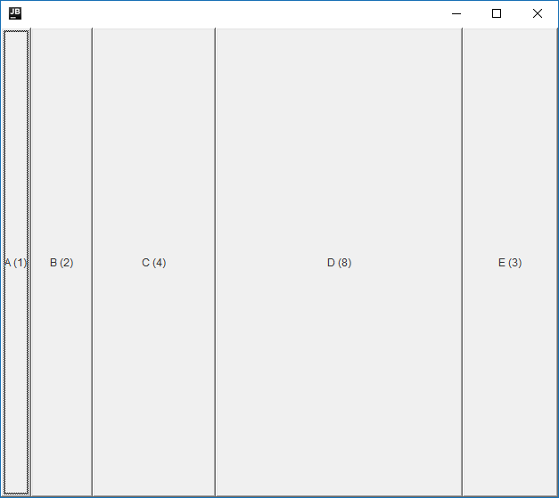
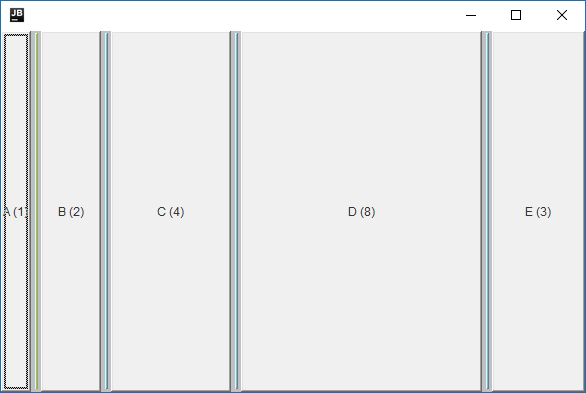
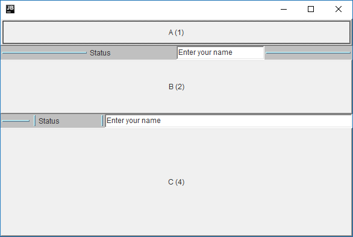

A Layout Manager for Split Windows

<!--more-->

NOTE: I'm updating my website, and this is pretty ancient... I'm keeping this here for historical purposes. Ran the code in Android Studio to get pics... Still works, but maaaaaan, it's ugly. Some folks actually used it back-in-the-day, and I used it in ParseView...

SplitterLayout is a simple layout manager that handles segmented displays with optional draggable bars between them.  In its simplest use, it's just a nice proportional layout manager.  More complex uses can create some interesting GUIs.

Here are some examples.  I'll add more information to this page as I get time.   SplitterLayout is available as part of the TabSplitter distribution.  See [TabSplitter](index.html) for details on how to download it.

NOTE 1: All of these examples require a JDK 1.1 compatible browser.

NOTE 2: Because I use AWT Windows to represent the SplitterBars as they are moving, they will probably appear with the words "Warning Applet Window" or something like that on them as they are being dragged.  I'm trying to come up with a solution for this... Grr... Arg...

# Proportional layouts with no SplitterBars

The above layout was created with the following code:

	package com.magelang.test;

	// GAH! Forgive the import-on-demand... I wrote this before my article on it!
	import java.applet.*;
	import java.awt.*;
	import com.magelang.splitter.*;

	public class SplitterEx1 extends Applet {

		public void init() {
			super.init();
			setLayout(new SplitterLayout(SplitterLayout.HORIZONTAL));
			add("1",new Button("A (1)"));
			add("2",new Button("B (2)"));
			add("4",new Button("C (4)"));
			add("8",new Button("D (8)"));
			add("3",new Button("E (3)"));
		}
	}  

The quoted numbers act as proportions to determine the amount of space each component gets.

# Adding SplitterBars

The above layout was created with the following code:

package com.magelang.test;

	import java.applet.*;
	import java.awt.*;
	import com.magelang.splitter.*;

	public class SplitterEx2 extends Applet {
		public void init() {
			super.init();
			setLayout(new SplitterLayout(SplitterLayout.HORIZONTAL));
			add("1",new Button("A (1)"));
			add(new SplitterBar());
			add("2",new Button("B (2)"));
			add(new SplitterBar());
			add("4",new Button("C (4)"));
			add(new SplitterBar());
			add("8",new Button("D (8)"));
			add(new SplitterBar());
			add("3",new Button("E (3)"));
		}
	}  

Adding Splitterbars between components allows the user to resize the components.  The quoted numbers are now only used as an initial size for the components.

# SplitterBars can contain other components!

SplitterBars are just Panels with dragging and painting stuff added.  They can contain any other components you want in any layout (even another SplitterLayout!)  The following shows a simple "movable status bar" layout:

The above layout was created with the following code:

package com.magelang.test;

	import java.applet.*;
	import java.awt.*;
	import com.magelang.splitter.*;

	public class SplitterEx3 extends Applet {
		public void init() {
			super.init();
			setLayout(new SplitterLayout(SplitterLayout.VERTICAL));
			add("1",new Button("A (1)"));
			SplitterBar b1 = new SplitterBar();
			b1.setLayout(new GridLayout(1,0));
			b1.add(new SplitterSpace());
			b1.add(new Label("Status"));
			b1.add(new TextField("Enter your name"));
			b1.add(new SplitterSpace());
			add(b1);
			add("2",new Button("B (2)"));
			SplitterBar b2 = new SplitterBar();
			b2.setLayout(new SplitterLayout(SplitterLayout.HORIZONTAL));
			b2.add("5",new SplitterSpace());
			b2.add(new SplitterBar());
			b2.add("10",new Label("Status"));
			b2.add(new SplitterBar());
			b2.add("40",new TextField("Enter your name"));
			add(b2);
			add("4",new Button("C (4)"));
			}
	} 
