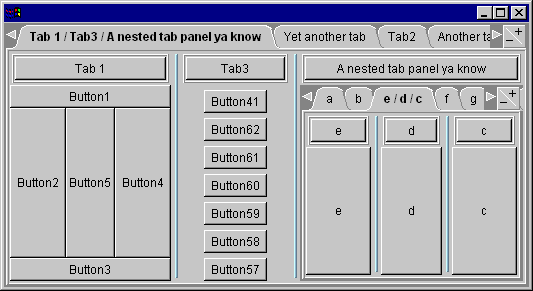

Way Cool (And Antiquated) Tabbed Panel Component

<!--more-->

# Latest News

*	10/17/2018
	* Updating my wesite... This is pretty obsolete, but I'm keeping it here for historical purposes and to make myself feel old... It was kind of a neat idea, allowing the user to re-arrange the UI however they would like, but a pretty weird implementation. When IDEs like Eclipse came out (not too long after this) they had very nice support for arrangeable views. The style of this component was definitely patterned after what VisualAge for Java looked like...
	
*	2/28/1998 - version 2.0.10 : This version enables the popup menu when executing under VisualAge for Java.  The popup menu bug that was introduced in VisualAge for Java version 1.0 patchset2 has been corrected.  This version of TabSplitter will work with VisualAge for Java in either of the following configurations:

	*   VisualAge for Java version 2.0 and later
    	*   **_Note: Until I get a chance to rebuild it, you'll need to open the following classes to the BeanInfo editor and choose "Generate BeanInfo" from the "Features" menu:_**
        	*   _**TabPanel**_
        	*   _**TabSplitter**_

# Overview

When developing [ParseView](../19980717-parseview), I needed a decent tabbed panel component.  The one that came with Symantec Visual Cafe was ok, but I liked to tinker, so I wrote this one up.

It's evolved quite a bit over the past few months, and I came up with the cool idea of combining my [SplitterLayout](../19980228-splitterlayout) with it to make **TabSplitter**, tabbed component of the Gods!  (No, really, my ego's more in check than it may seem...)

So what the hell does it do?  It looks and acts like a nice tabbed panel, complete with OS/2-like +/- buttons and a pop-up menu for easy flipping through the contained components. The following screenshot illustrates what **TabSplitter** can do:

But it's hiding the neat feature.  If you drag a tab on top of another tab, they are merged together into one tab with a splitter bar separating them.   Pressing the title button at the top of each sub-panel will separate that component back into the tab panel.

These components are _**free**_ for any use you see fit (other than selling the components as a standalone product.)

# Downloadable files

*   [tabsplitter.zip](tabsplitter.zip) (120K).  All source files, documentation and a jar containing all the class files.

The SplitterLayout can be used on its own too!  It's a nice way to create panels with splitter bars.  See [SplitterLayout](../19980228-splitterlayout).

Note that the documentation is not yet complete.  I did what I could before going insane adding doc comments.  Next time I'll do more as I code.  (That's what we all say, eh?)
