Let's get familiar with Java Layout Managers!

<!--more-->

(I wrote this article for the Sun Java Developer Connection website around 1998 and is no longer available. I used the Wayback Machine to retrieve it and post it here)

This module will explore in great detail how the standard Abstract Window Toolkit (AWT) layout managers perform their jobs and how they can be effectively nested to create useful graphical user interfaces (GUIs).

**Course Outline**

*   [Why do you need Layout Managers?](#whyNeed)
    *   [Window Expanded, Components Stay Put](#sin1)
    *   [Components Designed for a Specific Look-And-Feel or Font Size](#sin2)
    *   [Components Designed for a Specific Language](#sin3)
*   [What are Layout Managers?](#whatAreLMs)
    *   [Component Size Methods](#componentMethods)
    *   [Layout Managers and Containers](#containers)
        *   [The`add(...)`Methods](#addMethods)
        *   [Container Insets](#insets)
*   [The Standard AWT Layout Managers](#standardLMs)
    *   `[Flowlayout](#flowlayout)`
        *   [`FlowLayout`Variations](#flVariations)
        *   [Preferred Size of a`FlowLayout`Container](#flPrefSize)
        *   [`FlowLayout`Strategies and Potential Pitfalls](#flStrategy)
    *   `[BorderLayout](#borderLayout)`
        *   [How Is`BorderLayout`Laid Out?](#blHow)
        *   [`BorderLayout`Variations](#blVariations)
        *   [Preferred Size of a`BorderLayout`Container](#blPrefSize)
    *   `[GridLayout](#gridLayout)`
        *   [Preferred Size of a`GridLayout`Container](#glPrefSize)
        *   ["Ok" and "Cancel" Revisited](#okCancelAgain)
    *   `[CardLayout](#cardLayout)`
        *   [Preferred Size of a`CardLayout`Container](#clPrefSize)
    *   `[GridBagLayout](#gridBagLayout)`
*   [Setting the Initial Frame Size](#pack)
*   [Nesting Layout Managers to Achieve Nirvana](#nesting)
    *   [The GUI to Create](#gui)
    *   [How to Design this GUI](#guiDesign)
    *   [A Helper Class:`FileDisplay`](#fileDisplay)
    *   [Back to the Main FTP GUI...](#mainGui)
    *   [Looking at Some Code for this GUI](#ftpCode)
*   [A Very Common Layout Need](#commonNeed)
*   [For More Information...](#moreInfo)

  
**Why do you need Layout Managers?**

To describe why layout managers are necessary, all you need to do is examine a few of the problems they solve. Look at the following screen shots. These describe several_GUI sins_that are all too common:

**Window Expanded, Components Stay Put**

The first layout sin is to ignore a user-resize. The most common display size is probably still 640x480, so it's a good idea to make sure your application fits on that size screen. However, some users have much more screen real estate and want to take advantage of it. Non-resizable GUIs can be extremely frustrating. For example, in the initial display of a screen, the name entered is rather long, so it doesn't quite fit in the text field such that all is visible at once:

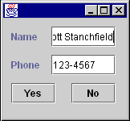

In the hopes of seeing the entire name at once, you could expand the dialog horizontally. Unfortunately, the programmer who wrote this application used absolute positioning and sizing, so the components in the dialog do not expand:

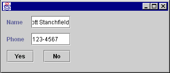

After reporting this behavior, the developer realizes the error that has been committed and changes the GUI to resize properly:

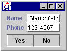

  
**Before resizing**

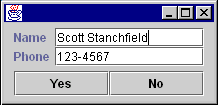

  
**After resizing**  
  
  
**Components Designed for a Specific Look-And-Feel or Font Size**

Another common problem is expecting all platforms or `LookAndFeel` libraries (when using Java Foundation Classes (JFC) Project Swing technology) to have the same sizing characteristics. The following picture shows the above GUI under the`MotifLookAndFeel`of the JFC Project Swing technology without using a layout manager:

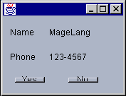

Notice that the`MotifLookAndFeel`uses a wider, empty border around the buttons, causing some undesirable drawing effects. Switching font sizes will have a similar effect.

**Components Designed for a Specific Language**

Some words take up the same amount of space in different languages. "No" is a good example, as it's spelled that way in several languages.

However, most words have varying lengths depending on which language you are using. For example:

A simple button to end an application. The programmer didn't give much thought to translations into other languages...

...such as German. _Auf Wiedersehen_ gets chopped to the much smaller _Wieder_.

This is unfortunate for two reasons:

*   The user doesn't see the entire phrase, but even worse...
*   ..."wieder" means _again_.

  
**What are Layout Managers?**

A layout manager encapsulates an algorithm for positioning and sizing of GUI components. Rather than building the layout algorithms into your code and watching for window resizing and other layout-modifying events, the algorithm is kept separate. This allows a layout algorithm to be reused for several applications, while simplifying your application code.

`LayoutManager` is an interface in the Java class libraries that describes how a `Container` and a layout manager communicate. It describes several methods which:

*   Ask for sizing information for the layout manager and the components it manages.
*   Tell the layout manager when components are added and removed from the container.
*   Size and position the components it manages.

An additional interface, `LayoutManager2`, was added in JDK 1.1, which adds a few more positioning and validation methods.

**Component Size Methods**

The `Component` class defines several size accessor methods to assist the layout process. Each of these methods returns a `Dimension` object describing the requested size. These methods are as follows:

*   `public Dimension getPreferredSize()`  
    This returns the desired size for a component.
    
*   `public Dimension getMinimumSize()`  
    This returns the smallest desired size for a component.
    
*   `public Dimension getMaximumSize()`  
    This returns the largest desired size for a component.

Layout managers will use these sizing methods when they are figuring out where to place components and what size they should be. _Layout managers can respect or ignore as much or as little of this information as they see fit._ Each layout manager has its own algorithm and may or may not use this information when deciding component placement. Which of these methods is respected or ignored is very important information and should be documented carefully when creating your own layout manager.

Controlling the sizes returned for your own components can be accomplished in two ways, depending on whether you are using the JFC Project Swing components.

If your component is a JFC Project Swing component, you inherit three methods,`setPreferredSize(Dimension)`, `setMinimumSize(Dimension)` and `setMaximumSize(Dimension)`. You can call these methods directly to explicitly set the size information for a component. For example:

	JButton okButton = new JButton("Ok");
	okButton.setPreferredSize(new Dimension(100,10));

You should only adjust the sizes if you're really sure what you're doing. (The above example is probably_not_a good idea...)

If your component is not a JFC Project Swing component, you will need to subclass it to adjust the sizes. For example:

	public class MyButton extends Button {
		public Dimension getPreferredSize() {
			return new Dimension(100,10);
		}	
	}
  
 
**Layout Managers and Containers**

A layout manager must be associated with a `Container` object to perform its work. If a container does not have an associated layout manager, the container simply places components wherever specified by using the `setBounds()`, `setLocation()` and/or`setSize()` methods.

If a container has an associated layout manager, the container asks that layout manager to position and size its components before they are painted. The layout manager itself_does not_perform the painting; it simply decides what size and position each component should occupy and calls `setBounds()`, `setLocation()`and/or`setSize()` on each of those components.

A `LayoutManager` is associated with a `Container` by calling the `setLayout(LayoutManager)` method of `Container`. For example:

	Panel p = new Panel();
	p.setLayout(new BorderLayout());

Some containers, such as `Panel`, provide a constructor that takes a layout manager as an argument as well:

	Panel p = new Panel(new BorderLayout());
  
**The `add(...)` Methods**

Containers have several methods that can be used to add components to them. They are:

	public Component add(Component comp)
	public Component add(String name, Component comp)
	public Component add(Component comp, int index)
	public void add(Component comp, Object constraints)
	public void add(Component comp, Object constraints, int index)
 

Each of these methods adds a component to the container and passes information to the layout manager of the container. All of the methods take a`Component`parameter, specifying which component to add. Some take an index. This is used to specify an order in the container; some layout managers (such as`CardLayout`) respect the ordering of added components.

The other parameters, `name` and `constraints` are information that can be used by a layout manager to help direct the layout. For example, when adding a component to a container that is managed by a `BorderLayout`, you specify a compass position as a constraint.

Each of the above`add()`methods delegates its work to a single`addImpl()`method:
  
	protected void addImpl(Component comp, Object constraints, int index)

Note: _addImpl_ stands for "implementation of the add method."

This method is the one that does all the work. It adds the `Component` to the `Container`, and, if a layout manager is managing the container layout, calls the `addLayoutComponent()` method of the layout manager. It is through `addLayoutComponent()` that the layout manager receives the constraints (from the `add()` call).

If you create a subclass of `Container` and want to override an `add()` method, you only need to override `addImpl()`. All other `add()` methods route through it.

**Container Insets**

In addition to a layout manager, each `Container` has a `getInsets()` method that returns an `Insets` object. The `Insets` object has four public fields: `top`, `bottom`, `left` and `right`.

These insets define the area a container is reserving for its own use (such as drawing a decorative border). Layout managers_must_respect this area when positioning and sizing the contained components.

To demonstrate, create a simple `Panel` subclass that provides a raised, 3D border around whatever is contained within it. You'll define this border as being 5 pixels away from each edge of the container border, and reserving some extra room between it and the laid out components. The class will look something like this:

	public class BorderPanel extends Panel {
		private static final Insets insets = new Insets(10,10,10,10);
		public Insets getInsets() {return insets;}
		public void paint(Graphics g) {
			Dimension size = getSize();
			g.setColor(getBackground());
			g.draw3DRect(5,5,size.width-11, size.height-11, true);
		}
	}

To create the panel, you defined a static `Insets` object that represents the space to reserve. Because that space won't change, you used a single static final instance of it. You'll return this instance anytime a layout manager (or anyone else) calls `getInsets()`.

You then define a `paint()` method that gets the size of the container into which it is painting, then draws a raised border within that space. If you use the above class as follows:

	Frame f = new Frame("Test");
	f.setLayout(new GridLayout(1,0));
	f.setBackground(Color.lightGray);
	BorderPanel p = new BorderPanel();
	p.setLayout(new GridLayout(1,0));
	p.add(new Button("Hello"));
	f.add(p);
	f.setVisible(true);
	f.pack();
  

you'll get the following GUI:

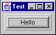

If you are not familiar with `GridLayout`, it will be discussed[later](#gridLayout).

You can get another interesting effect by adding the following to the `paint()` method:

	g.draw3DRect(6,6,size.width-13,size.height-13,false);

after the first `draw3DRect()`:

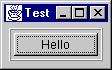

or if you swap the `true` / `false` on the two `drawRect()` calls:

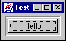

If you are using the JFC Project Swing components, you will want to explore the various `Border` classes provided to generate these types of effects, instead of using `Insets`.

**The Standard AWT Layout Managers**

The AWT library includes five layout managers. These can be used in various combinations to create just about any GUI you may possibly want to write. The standard AWT layout managers are:

*   `FlowLayout`
*   `BorderLayout`
*   `GridLayout`
*   `CardLayout`
*   `GridBagLayout`

Each of these will now be discussed in detail, including strategies and pitfalls when using them. By themselves, these layout managers may not seem terribly useful. However, when combined they become incredibly flexible.**`FlowLayout`**

This is the simplest of the AWT layout managers. Its layout strategy is:

*   respect the preferred size of all contained components
*   lay out as many components as will fit horizontally within a container
*   start a new row of components if more components exist
*   if all components can't fit, too bad!

To add components to a container managed by `FlowLayout`, you could use one of the following `add()` methods:

	public Component add(Component comp)
	public Component add(Component comp, int index)

You do not specify any constraints for the components, as `FlowLayout` _only_ depends on the order of the `add()` calls (or the index specified in the call to `add(Component, int)`.)

Examine a simple `FlowLayout` in action. Suppose you had the following class definition:

	public class FlowTest {
		public static void main(String[] args) {
			Frame f = new Frame("FlowTest");
			f.setLayout(new FlowLayout());
			f.add(new Button("A"));
			f.add(new Button("B"));
			f.add(new Button("C"));
			f.add(new Button("D"));
			f.add(new Button("E"));
			f.setVisible(true);
		}
	}

This class creates a `Frame` and adds five buttons to it. It lays the buttons out as many can fit per row, then moves to the next row to display more of them. The following pictures show the frame being expanded horizontally:

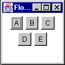  
**Initial Size**

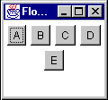  
**Some horizontal expansion**

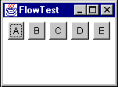  
**More horizontal expansion**

Notice how the layout is fitting as many components per line as possible. If there isn't room for all the components, they are simply not shown:

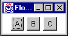

  
**_`FlowLayout`Variations_**

`FlowLayout` can be customized at construction time by passing the constructor an alignment setting:

*   `FlowLayout.CENTER`(the default)
*   `FlowLayout.RIGHT`
*   `FlowLayout.LEFT`

These settings adjust how the components in a given row are positioned. By default, all components in a row will be separated by an horizontal gap, then the whole chunk will be centered in the available width. `LEFT` and `RIGHT` define padding such that the row is left or right aligned. The alignment can also be changed by calling the `setAlignment()` method of `FlowLayout` with one of the same alignment constants.

`FlowLayout` can also be customized with different horizontal and vertical gap settings. These specify how much space is left between components, horizontally (hgap) and vertically (vgap)

**Preferred Size of a`FlowLayout`Container**

Recall that when a `Container` is asked for its preferred size, it bases that preferred size on its layout manager. This raises the subject of what `FlowLayout`would prefer to do with its components.

Unfortunately, there is no way for a container to know anything about the size of its parent or how its parent's layout manager plans to lay _it_ out. So, the only information available to determine the preferred size of a container is the set of components contained within it.

`FlowLayout`'s preference would be to lay all its components out into a _single row_. This means that its preferred height would be the maximum height of any of its components plus some "slop" known as its`vgap`. (`vgap` and `hgap`are common properties of most of the standard layout managers, and specify how far apart components are placed.) The preferred width would be the sum of all widths of its contained components, plus an `hgap` between each and on either end of the row.

Think about the consequences of this. What would happen if a `FlowLayout`\-managed container was nested within another `FlowLayout`\-managed container? For example:

	Panel p1 = new Panel(new FlowLayout());
	Panel p2 = new Panel(new FlowLayout());
	p2.add(new Button("A"));
	p2.add(new Button("B"));
	p2.add(new Button("C"));
	p2.add(new Button("D"));
	p2.add(new Button("E"));
	p1.add(p2);

Think this through a bit and the answer is very disconcerting. The following walks you through the layout process:

1.  p1's parent container tells it to lay itself out.
2.  p1 sees that it has a layout manager and delegates thelayout task to it.
3.  p1's `FlowLayout` checks the preferred sizes of all its components:
    1.  The only component in p1 is p2
    2.  p2 sees it has a layout manager and delegates the preferred size request to the layout manager:
        1.  p2's `FlowLayout` states that it would prefer to lay out all of its components in a single row.
        2.  p2's `FlowLayout` asks its components (the buttons) for their preferred sizes and calculates the size of that single, preferred row.
        3.  p2's `FlowLayout` returns that preferred size.
    3.  p2 returns the preferred size.
4.  p1's `FlowLayout` tries to respect the preferred size of p2 as much as possible.
    *   If there's enough room for the single row, it sets the bounds of p2 to its preferred size.
    *   If there's not enough horizontal room, it sets p2's bounds to the single-line height and as much width as is available.
    *   If there's not enough horizontal or vertical room, it sets the bounds of p2 to whatever it has.

So what does this tell us? If a `FlowLayout`\-managed container is placed within another container whose layout manager respects its preferred height, _the nested`FlowLayout`\-managed container will always have a single row_.

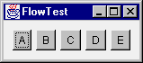  
**Before Resizing**

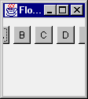  
**After Resizing**

  
**_`FlowLayout`Strategies and Potential Pitfalls_**

Keep the following in mind when using a`FlowLayout`:

*   Never nest a`FlowLayout`\-managed container within a container whose layout manager respects preferred height.
    *   Caveat: If you only have a few components, this is not as important to avoid.
*   The `FlowLayout` manager effectively hides components if they won't fit.
    *   There is no visual indication of this to the user—as far as the user is concerned, the unshown components never even existed.
*   Because of the previous point, `FlowLayout` is really only useful when you have a small number of components.
*   `FlowLayout` is_horizontally_biased. If you want a_vertical_flow layout, you must write your own. (Or use the`BoxLayout`manager which comes with the JFC Project Swing component set.The`BoxLayout`manager is discussed in theFundamentals of Swing: Part Itutorial.)

  
**`BorderLayout`**

`BorderLayout` is probably the most useful of the standard layout managers. It defines a layout scheme that maps its container into five logical sections:

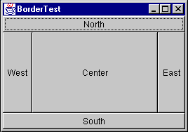

The first thing going through your mind should be "but I will_never_have a GUI that looks like that!" Moreover, you are probably correct. However, the secret is in mastering its nesting capabilities, and using two or three of the logical sections. (It's very rare that you'll actually use more than three of the positions in a container at once.)

First, look at the sample code for the above GUI:

	Frame f = new Frame("orderTest");
	f.setLayout(new BorderLayout());
	f.add(new Button("North"),  BorderLayout.NORTH);
	f.add(new Button("South"),  BorderLayout.SOUTH);
	f.add(new Button("East"),   BorderLayout.EAST);
	f.add(new Button("West"),   BorderLayout.WEST);
	f.add(new Button("Center"), BorderLayout.CENTER);

The `BorderLayout` manager requires a constraint when adding a component. The constraint can be one of the following:

*   `BorderLayout.NORTH`
*   `BorderLayout.SOUTH`
*   `BorderLayout.EAST`
*   `BorderLayout.WEST`
*   `BorderLayout.CENTER`

These constraints are specified within the following two`add()`methods:

*   `public void add(String constraint, Component component)`  
    This is the "old" form of adding a constraint. JDK 1.0.2 only provided for constraints that were represented by a`String`to be added when adding a`Component`to a`Container`
    
*   `public void add(Component component, Object constraint)`  
    This is the "new" form of adding a constraint, added in JDK 1.1.

You'll see a few more variations of the`add()`method when you examine`CardLayout`[later](#cardLayout). Concentrate on just these forms for now.

For`BorderLayout`, the constraint argument describes which position the component will occupy. Note that the earlier`BorderLayout`example source code could have been written as follows:

	Frame f = new Frame("BorderTest");
	f.setLayout(new BorderLayout());
	f.add("North",  new Button("North"));
	f.add("South",  new Button("South"));
	f.add("East",   new Button("East"));
	f.add("West",   new Button("West"));
	f.add("Center", new Button("Center"));
 

The big difference is that the newer form (using the`BorderLayout.NORTH`type constraints) can be compile-time checked; if you type`BorderLayout.NORFH`the compiler will catch it. If you just type "Norfh", it will not be caught until runtime, causing an`IllegalArgumentException`to be thrown.

The Java 2 platform (previously known as the JDK 1.2) adds additional constants of`BEFORE_FIRST_LINE`,`AFTER_LAST_LINE`,`BEFORE_LINE_BEGINS`, and`AFTER_LINE_ENDS`. These are effectively equivalent to`NORTH`,`SOUTH`,`WEST`, and`EAST`, respectively. However, they could have other orientations where text is not oriented left-to-right, top-to-bottom. Examine the`java.awt.ComponentOrientation`class for additional information on language-sensitive orientation issues.

**_How Is`BorderLayout`Laid Out?_**

`BorderLayout`respects_some_of the preferred sizes of its contained components,_but not all_. Its layout strategy is:

1.  If there is a`NORTH`component, get its preferred size.  
    Respect its preferred_height_if possible, and set its width to the full available width of the container.
    
2.  If there is a`SOUTH`component, get its preferred size.  
    Respect its preferred_height_if possible, and set its width to the full available width of the container.
    
3.  If there is an`EAST`component, get its preferred size.  
    Respect its preferred_width_if possible, and set its height to the_remaining_height of the container.
    
4.  If there is an`WEST`component, get its preferred size.  
    Respect its preferred_width_if possible, and set its height to the_remaining_height of the container.
    
5.  If there is a`CENTER`component, give it whatever space remains, if any.

Now consider nesting a`FlowLayout`\-managed container inside a`BorderLayout`\-managed container. First, what would happen if you added the`FlowLayout`\-managed container as the`NORTH`or`SOUTH`component of the`BorderLayout`?

	Panel flow   = new Panel(new FlowLayout());
	Panel border = new Panel(new BorderLayout());
	flow.add(new Button("A"));
	flow.add(new Button("B"));
	flow.add(new Button("C"));
	flow.add(new Button("D"));
	flow.add(new Button("E"));
	border.add(flow, BorderLayout.NORTH);
  

Remember what happens when a`FlowLayout`\-managed container is added to a layout that respects preferred height?_The_`FlowLayout`_container will only ever have a single row_! It will never flow its components to more than that one row.

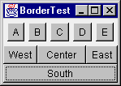

That was the easy one (now that you know the secret). Now, what if you add the`FlowLayout`\-managed container as the`WEST`or`EAST`component? To demonstrate, place the container in the`EAST`section:

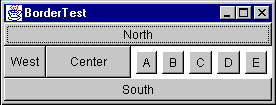

This initial display looks pretty much as you would expect. Each component is taking up its preferred size.

Next, reduce the width and increase the height. The`FlowLayout`container is still insisting on a single row for its preferred_width_(as you should expect) and is eating up room that the`CENTER`component would have liked to use. This result can be very unexpected, as you might think the`FlowLayout`container should expand to fill the`EAST`area and give some room back to the`CENTER`component:

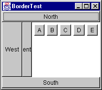

Remember: a`BorderLayout`container asks for the preferred size of each section and respects it as much as possible.

To demonstrate this even further, reduce the width until only the`EAST`component is still visible:

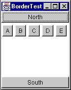

Finally, if you compress it more, the`FlowLayout`\-managed container is clipped to the available space:

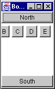

So, the only place that you should really put a`FlowLayout`managed container within a`BorderLayout`\-managed container is the`CENTER`section (unless you only have very few components in the`FlowLayout`).

Now consider some nice generalizations about`BorderLayout`:

*   NORTH and`SOUTH`positions in a`BorderLayout`can be useful if you want to_bind_the height of part of a GUI to that part's preferred height.
*   EAST and`WEST`positions in a`BorderLayout`can be useful if you want to_bind_the width of part of a GUI to that part's preferred width.
*   Once part of the GUI is bound, the`CENTER`is the expanding part.

These are very important properties of`BorderLayout`, and make it very powerful when used to create a more complex, nested GUI.

Take a very simple example. Suppose you wanted to create a simple labeled text field. You want this new component to exhibit the following properties:

*   The label takes up exactly as much horizontal room as needed
*   The label is to the left of the text field
*   The text field expands horizontally

You could start with the following code:

	Panel p = new Panel(new BorderLayout());
	Label nameLabel = new Label("Name:");
	TextField entry = new TextField();
	p.add(nameLabel, BorderLayout.WEST);
	p.add(entry, BorderLayout.CENTER);
 

Here you are binding the width of the label to its preferred width. It will take up that much space and not expand. The entry field is not bound and can expand. So, you achieve the desired result:

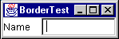  
**Initial size**

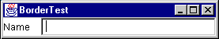  
**After horizontal stretch**

At least it_seems_you achieved the desired result. Look what happens when you expand vertically:

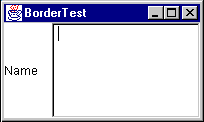

The`TextField`is stretched. So, you need to bind the height of the two components to their preferred height. This can be accomplished by placing the`Label`/`TextField`combination inside_another_`BorderLayout`\-managed container, as the`NORTH`or`SOUTH`component. Assuming that you want the fields to stay at the top of the GUI, you can place it to the`NORTH`:

	Panel p = new Panel(new BorderLayout());
	Label nameLabel = new Label("Name:");
	TextField entry = new TextField();
	p.add(nameLabel, BorderLayout.WEST);
	p.add(entry, BorderLayout.CENTER);
	Panel p2 = new Panel(new BorderLayout());
	p2.add(p, BorderLayout.NORTH);

Now, when you expand vertically, you get the following effect:

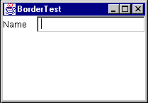

  
**_`BorderLayout`Variations_**

`BorderLayout`can be customized with hgap and vgap values at construction time. These values specify how much space is left between components, horizontally (hgap) and vertically (vgap).

**_Preferred Size of a`BorderLayout`Container_**

If a`BorderLayout`\-controlled Container is asked for its preferred size, what will it return? The idea behind its preferred size is to make sure all contained components are given their preferred sizes. First, look at the preferred width:

Looking at the above picture, there are three rows of components:

*   NORTH
*   WEST,`CENTER`and`EAST`(plus hgaps as needed)
*   SOUTH

The preferred width of the layout needs to take into account the widest of these rows. Using pw as the abbreviation for "preferred width", you can write a simple equation for the preferred width of a`BorderLayout`:

	pw = max(north.pw, south.pw,
			(west.pw + center.pw + east.pw + hgaps))

The_hgaps_amount to include depends on which components are present in the center row.

The preferred height (_ph_ in the following equation) depends on the sizes of the`NORTH`and`SOUTH`components plus the_tallest_of the middle-row components:

	ph = vgaps + north.ph + south.ph +
			max(west.ph, center.ph, east.ph)

The _vgaps_ amount depends on which rows are present in the `BorderLayout`.

A useful application of this preferred-size knowledge is creating two or three rows of components that each keep their preferred size. Suppose you had a`Label`, a`TextArea`, and a`TextField`that you wanted to lay out like this:

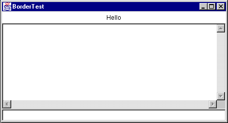

And when you expand it vertically, you_do not_want the components to stretch vertically:

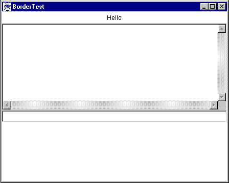

First, recall that you can_bind_the height of a component to its preferred height by placing it in the`NORTH`or`SOUTH`part of a`BorderLayout`. If that bound component happens to be another`BorderLayout`, (with`NORTH`,`CENTER`, and`SOUTH`components) each component within that layout would get its preferred height. This results in the above figure, with code to produce it:

	Frame f = new Frame("BorderTest");
	Panel p = new Panel(new BorderLayout());
	f.setLayout(new BorderLayout());
	p.add(new Label("Hello", Label.CENTER), 
				BorderLayout.NORTH);
	p.add(new TextArea(), BorderLayout.CENTER);
	p.add(new TextField(), BorderLayout.SOUTH);
	f.add(p, BorderLayout.NORTH);

An effective combination of a`FlowLayout`and a`BorderLayout`is for the common "Ok" and "Cancel" buttons on a dialog. For example:

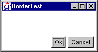

The above is accomplished with the following code:
 
	Frame f = new Frame("BorderTest");
	Panel p = new Panel(new FlowLayout(FlowLayout.RIGHT));
	f.setLayout(new BorderLayout());
	p.add(new Button("Ok"));
	p.add(new Button("Cancel"));
	f.add(p, BorderLayout.SOUTH);

There is one problem with this approach: the widths of the two buttons are different. You'll see a better way to create this type of GUI in a moment.

  
**`GridLayout`**

`GridLayout`lays out its components in a grid. Each component is given the same size and is positioned left-to-right, top-to-bottom.

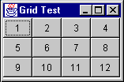

The code that produced the above GUI looks like:

	Frame f = new Frame("Grid Test");
	f.setLayout(new GridLayout(3,4));
	for (int x = 1; x < 13; x++)
		f.add(new Button("""+x));

When specifying a`GridLayout`, there are two main parameters:_rows_and_columns_. You can specify both of these parameters, _but only one will ever be used._ Take a look at the following code snippet from`GridLayout.java`:

	if (nrows > 0) {
		ncols = (ncomponents + nrows - 1) / nrows;
	else
		nrows = (ncomponents + ncols - 1) / ncols;

Notice that if_rows_is non-zero, it_calculates_the number of columns; if_rows_is zero, it calculates the number of rows based on the specified number of columns.

To the casual observer, a statement like

	f.setLayout(new GridLayout(3,4));

looks like it will_always_divide the screen into twelve sections, but that's not the case. In the above statement, you could substitute_any_value for the number of columns, and the effect would be exactly the same.

A better way to specify the_rows_and_columns_of a`GridLayout`is to_always_set one of them to zero. A zero value for_rows_of_columns_means "any number of".

Note: A word of caution: you cannot specify zero for_both_; an`IllegalArgumentException`will be thrown.

Specifying zero for one value makes the_design intent_obvious. If you always_want_four rows, say so; if you always_want_three columns, say so. The above example_should_be written as either

	f.setLayout(new GridLayout(3,0));

or
 
	f.setLayout(new GridLayout(0,4));

  
**_Preferred Size of a`GridLayout`Container_**

How do you determine the preferred size of a`GridLayout`?`GridLayout`wants to accommodate the preferred size of_all_its contained components if possible. To do this, it looks at all the preferred sizes and determines the maximum preferred width and the maximum preferred height._One thing to keep in mind, the maximum preferred height and maximum preferred width_do not_necessarily come from the same component_!

The`GridLayout`would like to set the size of_each_component to that maximum preferred width and maximum preferred height. (Remember—all components in a`GridLayout`will be the same size!) This makes the preferred size of a`GridLayout`

	pw = (maxPrefWidth \* cols) + (hgap \* (cols+1))
	ph = (maxPrefHeight \* rows) + (vgap \* (rows+1))
  
**_"Ok" and "Cancel" Revisited_**

One of the goals of the earlier "Ok" and "Cancel" dialog was to make the buttons the same size. This can be accomplished by putting the buttons in a single-row`GridLayout`. You can then add that`GridLayout`container to the`FlowLayout`, or use a nested`BorderLayout`in place of the`FlowLayout`. Here are both approaches:

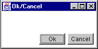

	Frame f = new Frame("Ok/Cancel");
	f.setLayout(new BorderLayout());
	Panel p = new Panel();
	p.setLayout(new FlowLayout(FlowLayout.RIGHT));
	Panel p2 = new Panel()
	p2.setLayout(new GridLayout(1,0,5,5));
	p2.add(new Button("Ok"));
	p2.add(new Button("Cancel"));
	p.add(p2, BorderLayout.EAST);
	f.add(p, BorderLayout.SOUTH);
  

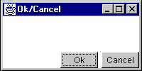

	Frame f = new Frame("Ok/Cancel");
	f.setLayout(new BorderLayout());
	Panel p = new Panel();
	p.setLayout(new BorderLayout());
	Panel p2 = new Panel()
	p2.setLayout(new GridLayout(1,0,5,5));
	p2.add(new Button("Ok"));
	p2.add(new Button("Cancel"));
	p.add(p2, BorderLayout.EAST);
	f.add(p, BorderLayout.SOUTH);
  

Notice the difference in appearance. The`FlowLayout`pads_around_the components with the hgap and vgap, while`BorderLayout`only pads_between_components (so the components butt right against the edges of the container.)

In both cases, the buttons now appear the same size. The nesting for this layout can be more easily seen in the following picture:

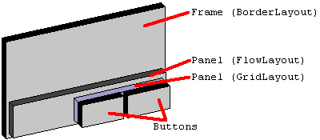

And similarly for the second version of the layout, using the nested`BorderLayout`.

  
**`CardLayout`**

`CardLayout`uses a different strategy than the other layout managers. Instead of assigning locations in the container for all nested components, it only displays one component at a time. Components can be added to a`CardLayout`using the following`add`methods:

	public void add(Component component, String key);
	public void add(String key, Component component);
	public void add(String key, Component component, int index);

The first two forms of the`add()`method will add the component at the end of the list of components for the container. The last form of the`add()`method will add the component at the specified position in the container. The position of the component within the container determines the order in which the components will be displayed via the manipulation methods of`CardLayout`.

A unique`String`key must be assigned for each component that is added to the container. For example:

	Panel p = new Panel(new CardLayout());
	p.add("one",   new Button ("the first component"));
	p.add(new Button ("the second component"), "two");
	p.add("three", new Button ("the third component"));
	p.add("between two and three", new Button ("the fourth component"), 2);

When components are added to container that is controlled by a`CardLayout`, a`String`key is associated with each component. Different components can be displayed by using the`next()`,`previous`, and`show`methods of`CardLayout`. The order in which components are added to the container determines their display order when using the`next()`and`previous`methods. For example:

	CardLayout l = (CardLayout)p.getLayout();
	l.previous(p);
	l.next(p);
	l.show(p, "two");

Notice that the`previous()`,`next()`, and`show()`methods require a reference to the container be passed into them has an argument. Layout managers do not keep a reference to the container that uses them. When performing actions such as calling`previous()`,`next()`, and`show()`, and, as you will see later, the laying out of the actual components, the layout manager needs to be informed of the container on which it is operating so it can have access to the components it is laying out.

`CardLayout`is commonly used in GUIs that want to organize their data into several smaller screens, rather than having all components on one larger screen. This is typically used in combination with several buttons for switching components within the`CardLayout`, or a tabbed panel component.

**_Preferred Size of a`CardLayout`Container_**

So how do you determine the preferred size of a`CardLayout`? Keeping in mind that the preferred size wants to take into account the preferred size of all contained components in the container, the preferred size of the`CardLayout`will be the maximum preferred width of all contained components and the maximum preferred height of all contained components

**`GridBagLayout`**

`GridBagLayout`tends to be one of the most difficult layout managers to understand. There are several reasons for this widely held opinion:

*   It is very complex and can be difficult to learn.
*   If_you_learn it and use it in your GUI, the poor maintenance programmer will have to learn it just as well as you did.
*   There are a few bugs in`GridBagLayout`that evidence themselves after components are added to or removed from the`GridBagLayout`after the`GridBagLayout`has been displayed  
    **Note:**`GridBagLayout`maintains some internal state that sometimes gets confused when components are added and removed.

Covering all of the details of using`GridBagLayout`could span an entire book. It will be covered briefly in the context of an example in a later[section](#nesting).

Without a GUI builder like VisualAge for Java or JBuilder, you should avoid`GridBagLayout`if at all possible. For most GUIs, you can achieve the same results by nesting the other, simpler layout managers.

**Setting the Initial Frame Size**

The`Frame`class provides a`pack()`method that helps set an "ideal" initial size. The`pack()`method calls the`getPreferredSize()`method of`Frame`to determine what size it would like to be laid out, and, if the screen is large enough to allow it, sets the Frame to that size. If there isn't enough screen space, the Frame will be limited to the available screen space.

**Nesting Layout Managers to Achieve Nirvana**

The following sections describe a real-life user interface and how it might be created with the help of Java layout managers.

**The GUI to Create**

A great example of nesting the standard layout managers is WS\_FTP, a Windows program for graphical FTP support.

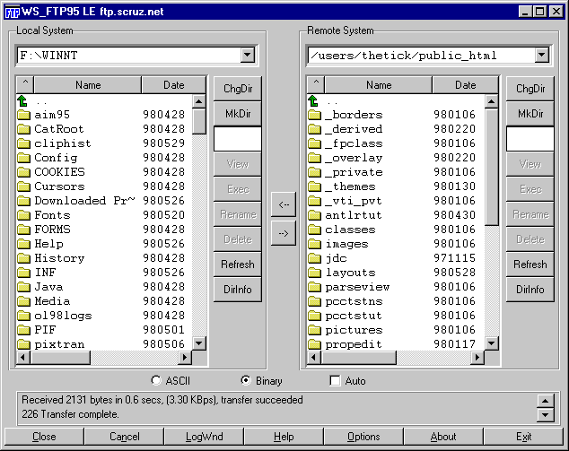

This GUI, while it may seem nice for "power users" is overly complex. The buttons at the bottom should really be menu items and the buttons to the right of each file list should be popup menus on the file lists. Nevertheless, the GUI as it stands makes a great example for nesting the basic layout managers.

**How to Design this GUI**

Before writing_any_GUI code, you should_always_do two things:

1.  **Draw a picture!**You would be surprised how many people try to visualize the GUI in their head. Drawing a picture makes the design significantly easier to develop.
2.  **Describe the resize behavior.**After drawing the picture, add information about which parts of the GUI will expand/collapse when the window is resized.

In the above example, ignore the border lines around components. These can be added after the GUI is constructed, either by applying the Decorator Pattern or, if using JFC Project Swing containers, by calling`setBorder()`.

Start with a picture describing what you want the GUI to look like. Simplify things a bit by removing the decorative borders and assume the existence of a "File List" component (probably a table with a header).

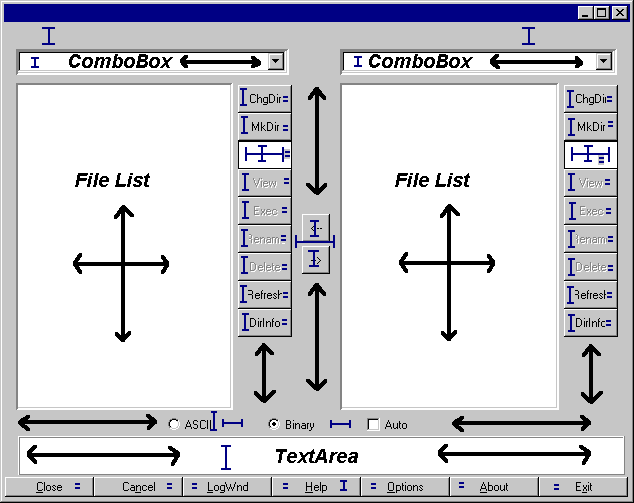

The arrows indicate which parts of the GUI will expand/collapse when the GUI is resized.

The above diagram is marked with the resize behavior of the GUI. The key explains which lines refer to fixed and varying sizing behaviors. When part of a component has a fixed size (horizontal, vertical, or both) it will not expand or contract as the window is resized. The equal signs (=) refer to adjoining components that have the same size.

A few notes on the GUI's behavior:

*   The two large sections that contain the File Lists should occupy the same amount of space.
*   The two arrow buttons in the middle should be vertically centered between the file list sections.
*   The ChgDir, MkDir, and other buttons all are the same size and are fixed at the group's preferred width and do not expand vertically. (The space below them expands when the window is stretched vertically.)
*   The buttons at the bottom of the GUI are all the same size and will expand/collapse horizontally with the GUI's width.
*   The ASCII, Binary and Auto checkboxes stay a fixed amount apart, floating as a group horizontally centered.

Now, the fun begins. You need to examine the GUI and try to visualize layout managers being used to represent sections of it. When trying to design the GUI, work from the outside edges inward. Always start by looking for "borders"; a component, or group of components that border an edge with a fixed width or height.

Looking at the above GUI, you can visualize it as a`BorderLayout`with two components: a`SOUTH`, and a`CENTER`:

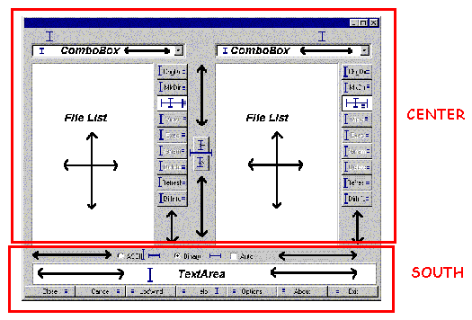

The`SOUTH`part of the`BorderLayout`has a fixed height, based on the preferred size of its components. The`CENTER`part will expand to fill the remaining room in the GUI. Examining the`SOUTH`section closer, you can view it as three parts:

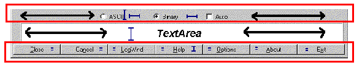

Note that there are three components here, stacked vertically, each with their preferred height. You might be tempted to stick this in a`GridLayout`, but that would force them all to take up the same amount of space vertically. That's not what you want.

Suppose you put these three components as`NORTH`,`CENTER`, and`SOUTH`of a`BorderLayout`. This new`BorderLayout`panel is nested as the`SOUTH`component of the overall`BorderLayout`. Think through what happens when this part of the GUI is laid out:

1.  The overall`BorderLayout`asks its`SOUTH`component for its preferred size
    1.  The`SOUTH`component, being a`BorderLayout`itself, asks_its_components for their preferred sizes
    2.  The nested`BorderLayout`returns a size that is
        *   Width = max preferred width of those three components.
        *   Height = sum of the preferred heights of those three components.
2.  The overall`BorderLayout`_assigns_the size of its`SOUTH`component to the frame's width, and the preferred height of that`SOUTH`component. The`CENTER`component gets all remaining room.
3.  The`SOUTH`component now gets its chance to lay out its contained components.
    1.  The`SOUTH`component asks for the preferred sizes of its children.
    2.  The`SOUTH`component assigns the width of all components to the width it has been given.
    3.  It grants_its_`NORTH`component its preferred height.
    4.  It grants_its_`SOUTH`component its preferred height.
    5.  It grants_its_`CENTER`component the remaining space.

Note that last bullet. The`CENTER`gets the remaining space. Because the overall`BorderLayout`had granted the`SOUTH`component its preferred height, _and_ the preferred height was equal to the sum of the preferred heights of the contained components, that nested`CENTER`component (the message`TextArea`) just happens to get its preferred height.

First, define the`NORTH`part of this sub-GUI. It has three components, equally spaced, with all of them centered across the width of the`Panel`. Sounds like a`FlowLayout`, eh? So, it is a`Panel`with a`FlowLayout`containing three`CheckBox`components. Notice that the first two`CheckBox`components must be associated with a`CheckboxGroup`so they will become radio buttons.

Now you must create the`SOUTH`part of this sub-GUI. It has seven`Button`components, all equally sized. The phrase "equally-sized" should immediately trigger`GridLayout`in your mind. So, the`SOUTH`part of the sub-GUI is a`Panel`with a`GridLayout`containing seven`Button`component. This`GridLayout`consists of a single row, so use parameters of (1,0) to its constructor.

The`CENTER`part is just a single component, a`TextArea`. You do not need to nest this inside another`Panel`; components can be directly added to containers... You'll set this`TextArea`'s number of rows to 3 and columns to 30. These numbers drive the_preferred size_of the`TextArea`; they have no effect on the`TextArea`once it has been sized by the layout manager. You must specify these because its placement in the layout asks for its preferred size, and it would return a larger number of rows than three if asked. The 30 will only come in handy if you`pack()`the`Frame`, where it will help contribute to the calculated width of the frame. One final note on this`TextArea`: if you place it in a`BorderPanel`as previously discussed in the`Insets`section above, you can give it a raised, lowered, or etched border.

To sum up what the layout looks like so far:

*   `Ftp`extends Frame, layout=`BorderLayout`
    *   SOUTH=`Panel`, layout=`BorderLayout`
        *   NORTH=Panel, layout=`FlowLayout`
            *   `Checkbox`("ASCII") w/`CheckboxGroup`
            *   `Checkbox`("Binary"), w/`CheckboxGroup`
            *   `Checkbox`("Auto")
        *   CENTER=`TextArea`(3,30)
        *   SOUTH=`Panel`, layout=`GridLayout`(1,0)
            *   `Button`("Close")
            *   `Button`("Cancel")
            *   `Button`("LogWnd")
            *   `Button`("Help")
            *   `Button`("Options")
            *   `Button`("About")
            *   `Button`("Exit")
    *   CENTER=? (that's next...)

Now you need to address the`CENTER`part of that overall`BorderLayout`. First, take a look at the following picture of the center section:

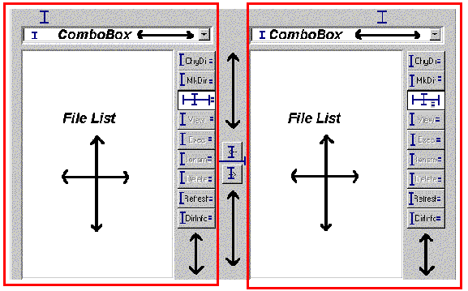

Notice anything interesting? It has to do with those two boxes drawn around the left and right side components. They are structurally the same._Exactly_the same. When two things are the same, and it's a chore to build it each time, you should think_reuse_.

**A Helper Class:`FileDisplay`**

Extract out one of those chunks and look at it separately. Put it in its own class called`FileDisplay`. Start examining this sub-GUI by looking for bordering components. You can immediately see three:

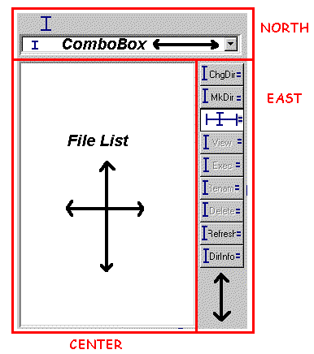

The`NORTH`part consists of a`Label`and combo box (you'll use an AWT`Choice`component for now), vertically stacked. The`CENTER`is a`List`component. The`EAST`is a bunch of`Button`s vertically stacked.

Looking first at the`NORTH`part, you need to have the`Label`and`Choice`take up their preferred height and the full width. Since this is the`NORTH`component, whatever they are contained in will receive its preferred height. By placing the`Label`and`Choice`as`NORTH`and`SOUTH`(or`NORTH`and`CENTER`, or`CENTER`and`SOUTH`) of a`BorderLayout`, they will receive their preferred height. Again, a`GridLayout`would be a bad choice because that assumes that both components want the same height. You could change the font size on the`Label`to make it larger, and you wouldn't want that to affect the size of the`Choice`.

The`CENTER`part is simple: just a`List`component. Not contained inside any`Panel`(unless you had a`Panel`subclass that provided a decorative border, such as the previously-discussed`BorderPanel`).

Now for the`EAST`part, which is a bit trickier. You want all the`Button`components the same size (your mind should immediately think`GridLayout`) but that size should be their preferred height and preferred width. Any space below the buttons expands and collapses.

Because you've placed the entire strip of`Button`s as an`EAST`component of a`BorderLayout`, their width is fixed on the preferred width of the container that encloses those buttons. To fix their height on their preferred height, you can place the strip_inside another`BorderLayout`, as the`NORTH`component_! So`EAST`is a`Panel`with a`BorderLayout`containing another`Panel`as its`NORTH`component, and that`NORTH``Panel`has a`GridLayout`controlling its buttons. The`GridLayout`is a single column of buttons, so its constructor parameters are (0,1).

Now for a look at the structure of the`FileDisplay`:

*   `FileDisplay`extends`Panel`, layout=`BorderLayout`
    *   NORTH=`Panel`, layout=`BorderLayout`
        *   NORTH=`Label`("")
        *   SOUTH=`Choice`
    *   CENTER=`List`
    *   EAST=`Panel`, layout=`BorderLayout`
        *   NORTH=`Panel`,layout=`GridLayout`(0,1)
            *   `Button`("ChgDir")
            *   `Button`("MkDir")
            *   `TextField`("\*.\*")
            *   `Button`("View")
            *   `Button`("Exec")
            *   `Button`("Rename")
            *   `Button`("Delete")
            *   `Button`("Refresh")
            *   `Button`("DirInfo")

To make this work properly, you must have`FileDisplay`"promote" the text property of its`Label`as a property of its own. Provide a`get()`and`set()`method for that property that simply gets and sets the text property of the`Label`. You'll see this when the code is reviewed later.

All that remains now is the`CENTER`section of the main GUI.

**Back to the Main FTP GUI...**

Examine what the`CENTER`section looks like without the details that you captured in`FileDisplay`:

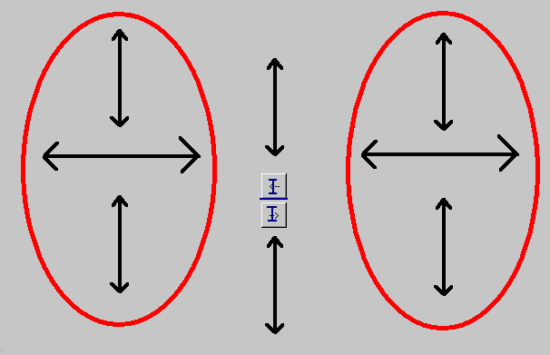

The two ovals represent the two instance of`FileDisplay`. The behavior of this part of the GUI is really up to four components: two`FileDisplay`components, which should take up equal amounts of space, and two`Button`components, each with its preferred size, floating casually in between them.

For purposes of aesthetics, assume that the buttons should be centered vertically.

This is a tricky layout situation. Among the standard layout managers, there is really only one choice: the`GridBagLayout`.

Examine how difficult this can be for a simple case like this. First, you need to determine where the grid cells are. You do this as is always necessary to do with`GridBagLayout`—draw lines between each pair of adjoining components all the way across the GUI:

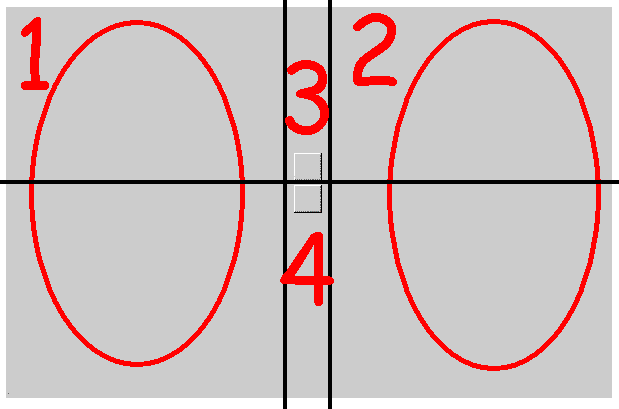

You can see that this`GridBagLayout`will have six cells and four (numbered) components. Each cell requires the configuration of a`GridBagConstraints`object, to be passed along as the constraints in the`add(Component component, Object constraints)`version of the`add()`method. You now need to walk through the`GridBagConstraints`options and determine what they should be.

First, the easy ones, gridx, gridy, gridwidth, gridheight, ipadx, and ipady. You'll use insets rather than padding, so it makes the ipadx and ipady settings zero for all components:

 parameter | 1 | 2 | 3 | 4
-----------|---|---|---|---
gridx      | 0 | 2 | 1 | 1
gridy      | 0 | 0 | 0 | 1
gridwidth  | 1 | 1 | 1 | 1
gridheight | 2 | 2 | 1 | 1
ipadx      | 0 | 0 | 0 | 0
ipady      | 0 | 0 | 0 | 0

Next you need to understand fill. Recall that this tells how the components will expand within their allotted cells. For components 1 and 2, this will be BOTH; you want components 3 and 4 to be their preferred size, so fill will be NONE.

Next, anchor. Because components 1 and 2 completely fill their allotted space, their anchor could be any value. Usually you use the default of`CENTER`. Component 3 sits at the bottom/center of its cell—that's the`SOUTH`anchor position. Component 4 sits at the top/center of its cell—that's the`NORTH`, anchor position.

The insets define the space to leave around components. There's no space around components 1 and 2, so their insets are all 0. You want some space around components 3 and 4. How about four pixels between them and any adjoining components. You can do this in several ways to put 4 pixels between components 3 and 4—give them 2 as their bottom and top insets.

Now the tricky part of this`GridBagLayout`: the weights. Think about the constraints rules you want:

1.  The cells of components 1 and 2 expand horizontally, equally
2.  The cells of components 3 and 4 do not expand horizontally
3.  The cells of components 1 and 2 expand vertically to fill the entire space equally
4.  The cells of components 3 and 4 expand vertically, each filling half the space

By rule #1, the weightx settings of components 1 and 2 must be equal. By rule #2, the weightx settings of components 3 and 4 must be 0. These are the only rules relating to horizontal space, so you can pick any weights you want for components 1 and 2, as long as they are the same. The weights are floating point numbers, and a nice convention to follow is to normalize the total weights to 1.0, giving each component 1 and 2 a weightx of 0.5.

By rule #3, the weighty settings of components 1 and 2 must be equal, and should be the total weighty of the container. By rule #4, the weighty settings of components 3 and 4 must be equal and be half of the total weighty. This gives the following results:

 parameter     | 1      | 2      | 3     | 4
---------------|--------|--------|-------|-------
gridx          | 0      | 2      | 1     | 1
gridy          | 0      | 0      | 0     | 1
gridwidth      | 1      | 1      | 1     | 1
gridheight     | 2      | 2      | 1     | 1
ipadx          | 0      | 0      | 0     | 0
ipady          | 0      | 0      | 0     | 0
fill           | BOTH   | BOTH   | NONE  | NONE
anchor         | CENTER | CENTER | SOUTH | NORTH
weightx        | 0.5    | 0.5    | 0.0   | 0.0
weighty        | 1.0    | 1.0    | 0.5   | 0.5
insets - top   | 0      | 0      | 0     | 2
insets - bottom| 0      | 0      | 2     | 0
insets - left  | 0      | 0      | 4     | 4
insets - right | 0      | 0      | 4     | 4

Setting these`GridBagConstraints`finishes the GUI design. Writing code for this GUI produces:

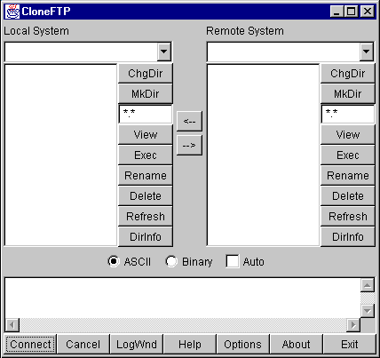

Which, decorations aside, looks just like you wanted it to!

A note on that last`GridBagLayout`: sometimes the initial thought regarding components 3 and 4 is to have weightx and weighty be zero for both components. This would produce the following result:

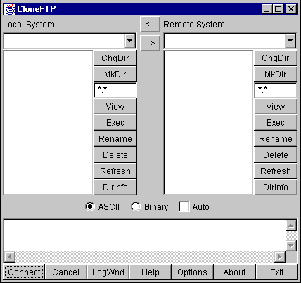

Notice where the "<--" and "-->" buttons are. The weightx and weighty values control the sizing of the_grid cells_that a component will occupy. If the sum of the weights for a given row or column in a`GridBagLayout`does not equal that of the other rows or columns,`GridBagLayout`makes up the difference by setting the weight of the_last_component in that row or column. In this case, you have three columns: two are the`FileDisplay`components, and the third is the column with the two buttons in it. Because the weighty values of the two buttons don't add to the same weighty values of the other two columns,`GridBagLayout`gives the lower button's grid cell the entire remaining height.

**Looking at Some Code for this GUI**

There are two common approaches to writing GUI code by hand. One involves building sub-GUIs via method calls, the other involves simply putting all the code in one-big blob.

The following example code for this GUI follows the first pattern:

*   [Ftp1.java](Ftp1.java)
*   [FileDisplay1.java](FileDisplay1.java)

This code was generated using IBM's VisualAge for Java, and simplified by removing the exception handling and "ivj" prefixes on all the variable names. The code follows a "lazy instantiation" strategy: no GUI components or sub-GUIs are created until needed. This has several advantages:

*   If a GUI in your application isn't used, it's never created, making the program more efficient.
*   You never need to worry if you've already created part of a GUI or not; you simply call the method in question to access that part of the GUI.
*   The GUI structure is directly reflected in the code. Nested GUI elements are calls made to other methods.

Of course, there are a few disadvantages as well:

*   More code to write
*   Slightly slower performance due to extra method calls (although this is minimal compared to other performance issues)

Another alternative is to use a GUI builder tool to create the interfaces. This can be a very attractive option, especially if your GUI is very complex.

Taking this same example and writing it_blob_\-style can result in the following code:

*   [Ftp2.java](Ftp2.java)
*   [FileDisplay2.java](FileDisplay2.java)

The advantage here is less code, although it can be difficult to see the GUI structure in the code. It can also be very difficult to properly order the creation/addition of GUI objects—you must be very careful to create everything you need before you use it.

**A Very Common Layout Need**

A common GUI need is to create some sort of input form. The following is a simple example:

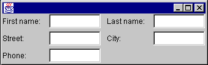

Note that in this GUI all of the labels line up horizontally, as do the text fields. When this GUI is expanded horizontally, the text fields should stretch but the labels should not.

One of the things to be mindful of when designing this GUI is what happens when the window is expanded vertically. Text fields tend not to look too good when expanded vertically. You probably want everything to keep its preferred height.

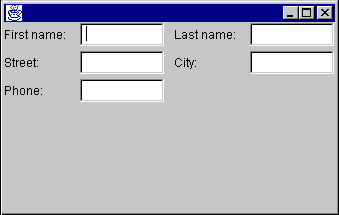

  
**Keeping the labels and text fields at their preferred height**

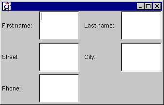

  
**Allowing the labels and text fields to stretch**

So, how do you design this GUI?

First, you need to think about how to bind the labels and text fields to their preferred height. This can be accomplished by placing all of the components as the`NORTH`component of a`BorderLayout`.

Next, you need to divide the GUI into two evenly spaced parts: the left half the right half. You should think "`GridLayout`" whenever you hear the phrase "equally spaced". This`GridLayout`consists of a single row; its parameters to its constructor would be (1,0). (In the above example, you are also setting hgap to five.)

Now what do you do about the pairs of text fields and labels? Your initial answer might involve placing each pair of text fields and labels into their own`BorderLayout`. For example:

	Panel panel1 = new Panel(new BorderLayout());
	panel1.add(new Label("First name:"), BorderLayout.WEST);
	panel1.add(new TextField(), BorderLayout.CENTER);

Using this strategy for each pair of labels and text fields, and adding each of those into their proper place in the GUI, you get a slightly undesirable affect:

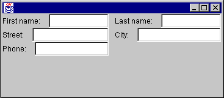

So what happened? Think about what`BorderLayout`does. It says "look at my`WEST`component. Give it its preferred width. Then, give the`CENTER`component the remaining available space." Note that it doesn't say "look at the component below me. Make sure my`WEST`component matches the same size as_his_`WEST`component." You need to somehow associate the labels with one other, and the text fields with one another.

The only way you can do this is to put all the labels that go together in the same container. Similar for the text fields. However, you also need to make sure the text fields and labels line up.

If you can make sure that the container that holds the labels takes up the same vertical space as the container that holds the text fields, you can use a`GridLayout`to divide each of those spaces evenly. But wait; you have already decided to put all of the labels and text fields in the`NORTH`component of the overall`BorderLayout`. This fixes the height of that set of components to its preferred height.

So, you start off with the overall`BorderLayout`. You add a Panel as the`NORTH`component of the`BorderLayout`. This`NORTH`Panel contains all the other components, and uses a single-row`GridLayout`.

Within that`GridLayout`, you add two Panels for the left and right halves of the GUI. Each of these panels will contain two components: a Panel that contains the labels, and a Panel that contains the text fields. Because you want the text fields to expand horizontally, and the labels to keep a fixed width, you want to use a`BorderLayout`.

The final GUI will be structured as follows:

*   Frame, layout=`BorderLayout`
    *   NORTH=Panel, layout=`GridLayout`(1,0)
        *   Panel, layout=`BorderLayout`
            *   WEST=Panel, layout=`GridLayout`(3,0)
                *   Label("First name:")
                *   Label("Street:")
                *   Label("Phone:")
            *   CENTER=Panel, layout=`GridLayout`(3,0)
                *   TextField
                *   TextField
                *   TextField
        *   Panel, layout=`BorderLayout`
            *   WEST=Panel, layout=`GridLayout`(3,0)
                *   Label("Last name:")
                *   Label("City:")
            *   CENTER=Panel, layout=`GridLayout`(3,0)
                *   TextField
                *   TextField

One thing to notice here is the parameters passed to the most deeply nested`GridLayout`containers. Your first thought when setting up these`GridLayout`containers should be "there is one column of components". The problem is, the first set of`GridLayout`containers have three components each; the second set has two components each. If you set a`GridLayout`constructor parameters to (0, 1), the GUI would look as follows:

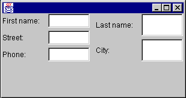

Notice the second set of labels and text fields is evenly spaced into two chunks. What you wanted was to have all the text fields and all the labels take up the same amount of vertical space (which means that there will be a blank spot at the bottom of the rightmost set of labels and text fields).
