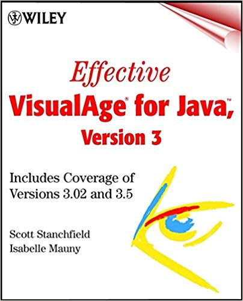
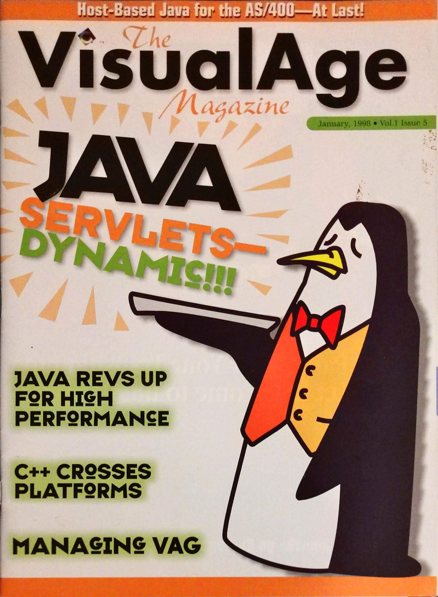

A list of my published works, a book, articles, presentations, courses, open-source software.

<!--more-->

# Book

(File this in the "never again" category... Well... Probably never again.)

*   Stanchfield, S. and Mauny, I. (2001). _Effective VisualAge for Java, version 3_. 1st ed. New York: John Wiley.
    https://www.amazon.com/Effective-VisualAge-Java-Version-Coverage/dp/0471317306

# Print Article

* 	Stanchfield, Scott A. "A Tune-Up for VisualAge for Java." _The VisualAge Magazine_, Jan. 1998, pp. 6-9

# Online Articles

*   From Java to Kotlin - Episode 1 (2019)  
    [http://javadude.com/posts/20190203-kotlin01](http://javadude.com/posts/20190203-kotlin01)
    
*   Eclipse Tips (2000)  
    (was hosted at javadude.com - obsolete - removed)
    
*   MVC in VisualAge for Java (2000)  
    (was hosted at javadude.com - obsolete - removed)
    
*   Advanced MVC in VisualAge for Java (2000)  
    (was hosted at javadude.com - obsolete - removed)
    
*   AWT Fundamentals (2000)  
    (was hosted at java.sun.com; no longer available)
    
*   Parsers, Part IV: A Java Cross Reference Tool (1999)  
    [http://svn.apache.org/repos/asf/maven/sandbox/trunk/jxr/maven-jxr/maven-jxr-java/src/site/resources/SeriesPt4.pdf](http://svn.apache.org/repos/asf/maven/sandbox/trunk/jxr/maven-jxr/maven-jxr-java/src/site/resources/SeriesPt4.pdf)
    
*   Effective Layout Management (1999)  
    [http://javadude.com/articles/layouts](http://javadude.com/articles/layouts)
    
*   ANTLR Documentation (contributor) (1998)  
    [http://www.antlr2.org](http://www.antlr2.org)
    
*   Layering Applications (1996)  
    [http://javadude.com/articles/layering.html](http://javadude.com/articles/layering.html)
    
*   Import on Demand is Evil! (1996)  
    [http://javadude.com/articles/importondemandisevil.html](http://javadude.com/articles/importondemandisevil.html)
    
*   Java is Pass-by-Value, Dammit! (1996)  
    [http://javadude.com/articles/passbyvalue.htm](http://javadude.com/articles/passbyvalue.htm)
    
*   Using JavaBean Accessors (1996)  
    [http://javadude.com/articles/accessors.html](http://javadude.com/articles/accessors.html)
    
*   Java Using the Right Comment (1996)  
    [http://javadude.com/articles/comments.html](http://javadude.com/articles/comments.html)
    
*   Converting a Grammar from LALR to LL (1996)  
    [http://javadude.com/articles/lalrtoll.html](http://javadude.com/articles/lalrtoll.html)
    
*   Why VisualAge for Java (1996)  
    (was hosted at javadude.com - obsolete - removed)
    
*   ANTLR Tutorial (1996)  
    [http://javadude.com/articles/antlrtut/index.html](http://javadude.com/articles/antlrtut/index.html)
    
*   PCCTS Tutorial (1996)  
    (was hosted at javadude.com - obsolete - removed)
    
*   JavaBean Property Editors (1996)  
    [http://javadude.com/articles/propedit/index.html](http://javadude.com/articles/propedit/index.html)
    
*   VisualAge for Java Tips and Tricks (1996)  
    (was hosted at javadude.com - obsolete - removed)    

# Conference Presentations

*   No Fluff Just Stuff ([http://www.nofluffjuststuff.com](http://www.nofluffjuststuff.com))
    
    *   Introduction to Eclipse (NFJS 2004)
    *   Eclipse Tips and Tricks (NFJS 2004)
    *   Adapter and Decorator: Tweaking Objects for Fun and Profit (NFJS 2003)
    *   Effective Interfaces (NFJS 2003)
    *   Patterns for Exception Handling (NFJS 2003)
        
*   JavaOne ([http://javadude.com/articles/javaone](http://javadude.com/articles/javaone))
    
    *   Creating Custom JSP Tags (2002)
    *   Effective Layout Management (2001)
    *   Hosted VisualAge for Java BoF Session (2001)
    *   MVC for You and Me (2000)
    *   Actions: Experience and Speculation (2000)
    *   Fun with Layout Managers (2000)

# Courseware

*   The Johns Hopkins University ([http://www.jhu.edu](http://www.jhu.edu))
    
    *   Android Mobile Development (2012-present)
    *   Domain-Specific Languages (2018-present)
    *   Design Patterns (2002-2014)
    *   Web Development (2002)
    *   Distributed Development on the WWW (2002)
    *   XML Technologies (2002)
        
*   Montgomery College, MD ([http://www.montgomerycollege.edu](http://www.montgomerycollege.edu))
    
    *   Java for Non-Programmers (2001-2002)
        
*   Tier Technology Training
    
    *   Servlets and Java Server Pages (2000-2001)
    *   Enterprise JavaBeans (2000-2001)
        
*   DPT Consulting
    
    *   VisualAge for Java (2000)
    *   Advanced VisualAge for Java (2000)
    *   Servlets and Java Server Pages (2000)
    *   Enterprise JavaBeans (2000)
        
*   MageLang Institute/jGuru.com ([http://jguru.com](http://jguru.com))
    
    *   AWT (1998-2000)
    *   Swing (1998-2000)
    *   VisualAge for Java (1998-2000)
    *   Advanced VisualAge for Java (1998-2000)
    *   Servlets and Java Server Pages (1998-2000)
        

# Java Users Group Presentations

*   Johns Hopkins University
    *   Android Mobile Development Bootcamp (2018)
    *   Kotlin Programming (2018 - 8-weeks)
    *   Tech Talk: DSLs and Code Generation (2017)
    *   Design Patterns Brown Bag Series (2015 - 7 weeks)
    *   Android Intents and Fragments (2014)

*   Java Users Groups (APL / Columbia MD / Montgomery County MD)
    *   Java 8 - Lambdas and Streams (2014)
    *   Code Generation With xText and xTend (2013)
    *   Template Method and Strategy (2011)
    *   Java Dynamic Proxies (2010)
    *   Effective Eclipse (2010)
    *   Java Enumerations (2009)
    *   Java Annotations: Meta-data and Code Generation (2009)
    *   Eclipse Plug-ins 101 (2009)

*   Northern Virginia Java Users Group
    *   Java Annotations: Meta-data and Code Generation (2009)
    *   ANTXR: XML Parsing Using ANTLR (2005)
    *   ANTLR: Parsing for Fun and Profit (2004)

# Open Source Software

*   Android State-Machine-Based Fragment Framework  
    (Pending release)
    
*   Android Easy Permissions Framework  
    (Pending release)
    
*   Android Room Two-Way Databinding    
    (Pending release)
    
*   MapBox Offline Vector MBTiles Support  
    (Pending release)

*   Bean Annotations (2008)  
    (Was on googlecode.com - currently not hosted)    
    
*   Eclipse Derived Warning Cleaner (2008)  
    (Was on googlecode.com - currently not hosted)    
        
*   Eclipse Dynamic Working Sets (2008)  
    (Was on googlecode.com - currently not hosted)    
    
*   Eclipse Visible Method Reporter (2008)  
    (Was on googlecode.com - currently not hosted)  
        
*   Eclipse Dependency Visualizer (2006)  
    (Was on googlecode.com - currently not hosted)    
    
*   ANTXR (XML Parser Generator) (2004)  
    (Was on googlecode.com - currently not hosted)    
    
*   ANTLR Eclipse Plugin (2000)  
    (No longer supported)
    
*   Eclipse Jindent Integration (1998)  
    (No longer supported)
    
*   ANTLR 2.x (contributor) (1998-2000)  
    [http://antlr2.org](http://antlr2.org)

*   ParseView ANTLR Debugger (1998)  
    [http://javadude.com/tools/parseview](http://javadude.com/tools/parseview)
    
*   SplitterLayout (1998)  
    [http://javadude.com/tools/tabsplitter/splitterlayout.html](http://javadude.com/posts/19980228-splitterlayout)
    
*   Swing BorderEditor (1998)  
    [http://javadude.com/tools/borderedit](http://javadude.com/tools/borderedit)
    
*   Swing BoxBeans (1998)  
    [http://javadude.com/tools/boxbeans](http://javadude.com/tools/boxbeans)
    
*   SWT Layouts (1998)  
    (No longer supported)
    
*   TabSplitter Bean (1998)  
    [http://javadude.com/tools/tabsplitter](http://javadude.com/tools/tabsplitter)
    
*   VisualAge AutoGut (1998)  
    [http://javadude.com/tools/autogut](http://javadude.com/tools/autogut)
    
*   VisualAge Importifier (1998)  
    [http://javadude.com/tools/importifier](http://javadude.com/tools/importifier)
    
